# Kiến Trúc Mô Hình ACT: RGB-D Input + Bimanual OpenArm (16-DOF)
**Cấu hình**: 01 Camera Ngực RGB-D (`[4, 480, 640]`) + Hai Cánh Tay Robot (16 Motors: 8 Tay Trái + 8 Tay Phải)  
**Phân loại trọng số**: 🔥 **Trainable (Lửa - Học được)** vs ❄️ **Fixed (Tuyết - Cố định / Frozen)**

---

## 1. Sơ Đồ Kiến Trúc Chiều Ngang (Horizontal Mermaid Diagram)

```mermaid
flowchart LR
    %% -------------------------------------------------------------
    %% SUBGRAPH 1: INPUTS
    %% -------------------------------------------------------------
    subgraph G1 ["1. ĐẦU VÀO (Inputs tại t)"]
        direction TB
        CamRGBD["📷 <b>Camera Trước Ngực RGB-D</b>\nShape: [4, 480, 640] (3 RGB + 1 Depth)\n❄️ Cảm biến vật lý thời gian thực"]
        JointState["🦾 <b>Góc Khớp 2 Tay (qpos)</b>\nVector [16] float32\n❄️ Telemetry đọc từ SocketCAN"]
    end

    %% -------------------------------------------------------------
    %% SUBGRAPH 2: BACKBONE & CVAE
    %% -------------------------------------------------------------
    subgraph G2 ["2. THỊ GIÁC & CVAE (Trainable vs Frozen)"]
        direction TB
        Conv1_Adapter["🔥 <b>4-Channel Conv1 Adapter</b>\nAdapter 4 kênh: RGB + Depth\n(Khởi tạo w_D = mean(RGB))"]
        ResNet["❄️ <b>ResNet-18 (Layers 1..4)</b>\nPretrained ImageNet (FROZEN)\nFeature Map: [512, 15, 20]"]
        PosEmbed2D["❄️ <b>2D Sinusoidal PE</b>\nMã hóa không gian bàn (Toán học)"]
        ImgProj["🔥 <b>1x1 Conv Image Projection</b>\nChiếu 512 → d_model (512)"]
        VisualTokens["<b>300 Visual Tokens</b>\nShape: [300, 512]"]
        
        QposProj["🔥 <b>Joint State Projection</b>\nLinear Layer: 16 → 512"]
        CVAE_Enc["🔥 <b>CVAE Encoder (2 Layers)</b>\nTransformer Self-Attention"]
        LatentHeads["🔥 <b>Latent Heads (μ, log σ²)</b>\nLinear Projections: 512 → 32"]
        Reparam["❄️ <b>Reparameterization Trick</b>\nTrain: z = μ + ε·σ | Test: z = 0"]
        LatentProj["🔥 <b>Latent Projection</b>\nLinear Layer: 32 → 512"]
    end

    %% -------------------------------------------------------------
    %% SUBGRAPH 3: TRANSFORMER POLICY
    %% -------------------------------------------------------------
    subgraph G3 ["3. TRANSFORMER POLICY (Dự đoán hành động)"]
        direction TB
        TokenMixer["<b>Memory Tokens (302 Tokens):</b>\n[300 Visual + 1 qpos + 1 Latent z]"]
        ActionQueries["🔥 <b>50 Action Queries (k=50)</b>\nLearnable Embeddings [50, 512]"]
        TemporalPE["❄️ <b>1D Temporal PE</b>\nSinusoidal Time Encoding"]
        TransDecoder["🔥 <b>Transformer Decoder (4 Layers)</b>\nMulti-Head Self-Attn & Cross-Attn"]
        ActionHead["🔥 <b>Action Linear Head</b>\nLinear: 512 → 16 Joint Targets"]
    end

    %% -------------------------------------------------------------
    %% SUBGRAPH 4: OUTPUT & CAN-FD
    %% -------------------------------------------------------------
    subgraph G4 ["4. ĐẦU RA ĐIỀU KHIỂN & CAN-FD"]
        direction TB
        ActionChunk["🎯 <b>Action Chunk [50, 16]</b>\nQuỹ đạo 50 bước góc cho 16 motor"]
        Ensemble["❄️ <b>Temporal Ensembling</b>\nTrọng số hàm mũ: ω_i = exp(-m·i)"]
        CANExecution["⚡ <b>SocketCAN can0 (5 Mbps)</b>\n16 gói tin Damiao MIT Mode @ 50Hz\n(8 Trái: 0x01..0x08 | 8 Phải: 0x21..0x28)"]
    end

    %% LIÊN KẾT LUỒNG DỮ LIỆU
    CamRGBD --> Conv1_Adapter --> ResNet --> ImgProj
    PosEmbed2D -.-> ImgProj --> VisualTokens --> TokenMixer

    JointState --> QposProj --> TokenMixer
    QposProj -.-> CVAE_Enc --> LatentHeads --> Reparam --> LatentProj --> TokenMixer

    TokenMixer --> TransDecoder
    TemporalPE -.-> ActionQueries --> TransDecoder

    TransDecoder --> ActionHead --> ActionChunk
    ActionChunk --> Ensemble --> CANExecution
```

---

## 2. Bảng Phân Định Chi Tiết: 🔥 Trainable (Lửa) vs ❄️ Fixed (Tuyết)

| Nhóm chức năng | Tên Module / Khối | Trạng thái | Giải thích lý do kỹ thuật |
| :--- | :--- | :---: | :--- |
| **Cảm biến đầu vào** | Camera Trước Ngực RGB-D `[4, 480, 640]` | ❄️ **Fixed** | Dữ liệu phần cứng thời gian thực (RGB + Depth), không có tham số học. |
| **Cảm biến đầu vào** | Góc Khớp Hiện Tại `qpos` `[16]` | ❄️ **Fixed** | Telemetry đọc từ CAN bus 16 motor Damiao qua giao thức MIT. |
| **Thị giác (Vision)** | Conv1 4-Channel Adapter | 🔥 **Trainable** | Tầng tích chập 4 kênh nhận `(RGB + D)`. Trọng số kênh Depth khởi tạo = `mean(w_RGB)` rồi fine-tune nhẹ. |
| **Thị giác (Vision)** | ResNet-18 Layers 1..4 | ❄️ **Fixed (Frozen)** | Đóng băng trọng số pretrained từ ImageNet để chống hiện tượng Overfitting khi tập dữ liệu demo nhỏ (50 episodes). |
| **Thị giác (Vision)** | 2D Sinusoidal Positional Encoding | ❄️ **Fixed** | Công thức hàm toán học sin/cos không gian 2D, cố định $100\%$, không có tham số. |
| **Thị giác (Vision)** | 1x1 Conv Image Projection | 🔥 **Trainable** | Chiếu feature map từ 512 kênh sang `d_model=512` phù hợp với Transformer. |
| **Trạng thái robot** | Joint State Linear Projection | 🔥 **Trainable** | Tầng Linear chiếu vector 16 góc khớp lên `d_model=512`. |
| **CVAE (Latent Space)**| CVAE Transformer Encoder (2 Layers) | 🔥 **Trainable** | Nén chuỗi hành động 50 bước tương lai + qpos thành phân phối phong cách $z$. |
| **CVAE (Latent Space)**| Latent Heads ($\mu, \log\sigma^2$) & Latent Proj | 🔥 **Trainable** | Các tầng Linear ánh xạ sang không gian ẩn $z \in \mathbb{R}^{32}$ và giải nén lại. |
| **CVAE (Latent Space)**| Reparameterization Trick | ❄️ **Fixed** | Công thức lấy mẫu ngẫu nhiên Gaussian $z = \mu + \epsilon \cdot \sigma$. Khi chạy Inference trên robot thật, **gán cứng $z = 0$**. |
| **Transformer Policy** | 50 Action Queries ($k=50$) | 🔥 **Trainable** | Tensor tham số tự học `nn.Parameter(torch.randn(1, 50, 512))` qua lan truyền ngược. |
| **Transformer Policy** | 1D Temporal Sinusoidal PE | ❄️ **Fixed** | Công thức hàm toán học sin/cos mã hóa thứ tự thời gian các bước $t, t+1, \dots, t+49$. |
| **Transformer Policy** | Transformer Decoder (4 Layers) | 🔥 **Trainable** | Trọng tâm của Policy: Học cơ chế Cross-Attention giữa Action Queries và Memory Tokens. |
| **Transformer Policy** | Action Linear Head | 🔥 **Trainable** | Tầng Linear chiếu từ 512 chiều ẩn ra 16 góc mục tiêu cho 16 khớp: `[50, 16]`. |
| **Điều khiển CAN** | Temporal Ensembling | ❄️ **Fixed** | Thuật toán trung bình trượt với hàm suy giảm trọng số mũ $\omega_i = \exp(-m \cdot i)$. |
| **Điều khiển CAN** | SocketCAN CAN-FD Damiao MIT Mode | ❄️ **Fixed** | Driver phần cứng nhị phân gửi 16 gói tin xuống bus `can0` ở tần số 50 Hz. |

---

## 3. Lợi Thế Vượt Trội Của Kênh Chiều Sâu (Depth) Cho Bài Toán Gấp Vải Hai Tay

1. **Đo đạc chính xác chiều cao mặt phẳng đáy ($Z = 0$)**:
   - Camera RGB thông thường dễ bị đánh lừa bởi bóng đổ của cánh tay robot.
   - Kênh Depth cung cấp độ cao tuyệt đối tính bằng milimét. Robot biết chính xác khi nào 2 đầu kẹp cách mặt vải $1\text{ cm}$ để đóng kẹp, **loại bỏ hoàn toàn lỗi đâm đầu kẹp xuống bàn làm quá dòng motor**.
2. **Nhận diện độ phồng của nếp gấp (Fold Wrinkles & Creases)**:
   - Áo thun trải trên mặt bàn có thể có nếp nhăn cùng màu với thân áo khiến ảnh RGB khó phát hiện.
   - Kênh Depth làm nổi bật ngay lập tức độ gồ ghề không gian của từng nếp vải.
3. **Quỹ đạo vòm cung Parabol 3D hoàn hảo**:
   - Hai cánh tay nâng nếp vải lên đúng độ cao $12 - 15\text{ cm}$ so với mặt bàn theo trục $Z$ và lật sang đối xứng, giúp tấm vải tự rủ phẳng phiu tự nhiên trước khi hạ xuống.

---
*Xem giao diện đồ họa tương tác HTML đầy đủ tại: [ACT_ARCHITECTURE.html](file:///c:/Users/Admin/Desktop/20261/VinRobotics/OpenArm/openarm_can/ACT_ARCHITECTURE.html).*
