# Kiến Trúc Mô Hình ACT (Action Chunking with Transformers) - Cấu Hình 1 Camera Ngực

## 1. Sơ Đồ Kiến Trúc Chiều Ngang (Horizontal Mermaid Diagram)

```mermaid
flowchart LR
    %% -------------------------------------------------------------
    %% SUBGRAPH 1: INPUTS
    %% -------------------------------------------------------------
    subgraph G1 ["1. ĐẦU VÀO (Inputs tại t)"]
        direction TB
        CamChest["📸 Camera Ngực (Chest RGB)\nKích thước: [3, 480, 640]"]
        JointState["🦾 Góc Khớp Hiện Tại (qpos)\nVector [8] (7 tay + 1 kẹp)"]
    end

    %% -------------------------------------------------------------
    %% SUBGRAPH 2: BACKBONE & CVAE
    %% -------------------------------------------------------------
    subgraph G2 ["2. THỊ GIÁC & CVAE"]
        direction TB
        ResNet["ResNet-18 + 2D Sinusoidal PE\nFeature Map: [512, 15, 20]"]
        VisualTokens["300 Visual Tokens\nShape: [300, 256]"]
        CVAE_Enc["CVAE Encoder\n(Chỉ train: Action Chunk + qpos)"]
        LatentZ["Biến tiềm ẩn z ∈ ℝ¹⁶\nTrain: z ~ N(μ,σ) | Test: z = 0"]
    end

    %% -------------------------------------------------------------
    %% SUBGRAPH 3: TRANSFORMER POLICY
    %% -------------------------------------------------------------
    subgraph G3 ["3. TRANSFORMER POLICY"]
        direction TB
        TokenMixer["Ghép Tokens (Memory):\n300 Visual + 1 qpos + 1 Latent z"]
        TransDecoder["Transformer Decoder (4 Layers)\nCross-Attention giữa Action Queries & Memory"]
        ActionQueries["50 Action Queries (k=50)\n+ 1D Temporal Sinusoidal PE"]
    end

    %% -------------------------------------------------------------
    %% SUBGRAPH 4: OUTPUT & CAN-FD
    %% -------------------------------------------------------------
    subgraph G4 ["4. ĐẦU RA & CAN-FD"]
        direction TB
        ActionChunk["Action Chunk dự đoán [50, 8]\n50 bước q_des trong 1 giây tới"]
        Ensemble["Temporal Ensembling\nTrọng số mũ làm mượt"]
        CANExecution["SocketCAN can0 (5 Mbps)\nDamiao MIT Mode 50Hz"]
    end

    %% LIÊN KẾT LUỒNG DỮ LIỆU TỪ TRÁI SANG PHẢI
    CamChest --> ResNet --> VisualTokens --> TokenMixer
    JointState --> TokenMixer
    JointState -.-> CVAE_Enc --> LatentZ --> TokenMixer

    TokenMixer --> TransDecoder
    ActionQueries --> TransDecoder

    TransDecoder --> ActionChunk
    ActionChunk --> Ensemble --> CANExecution
```

---

## 2. Điểm Khác Biệt Khi Chỉ Có 1 Camera Trước Ngực

1. **Giảm 50% chi phí tính toán thị giác (Vision FLOPs)**:
   - Thay vì phải chạy 2 mạng ResNet (Top camera + Wrist camera), mô hình giờ chỉ chạy duy nhất **1 mạng ResNet-18** cho camera ngực.
   - Thời gian inference giảm từ ~15ms xuống chỉ còn **~6 - 8ms**, cực kỳ nhẹ cho GPU!
2. **Chiến lược quan sát (Visual Conditioning cho bài toán Gấp Quần Áo)**:
   - Camera trước ngực góc nghiêng $40^\circ - 45^\circ$ bao quát toàn bộ mặt bàn $80 \times 80\text{ cm}$ (chứa tấm vải/áo thun trải rộng, nếp gấp, mép biên) lẫn vị trí tương đối của cánh tay OpenArm và đầu kẹp.
   - Trong bài toán gấp vải, camera ngực có lợi thế vượt trội vì góc nhìn từ trên cao chúc xuống không hề bị cánh tay che khuất khi thực hiện quỹ đạo vòm cung lật nếp gấp từ biên này sang biên kia.
3. **Action Chunking ($k=50$)**:
   - Dự đoán trước quỹ đạo 50 bước (~1 giây) tiếp theo.
   - Giúp chuyển động nâng hạ vòm cung cực kỳ trơn tru và liên tục, không bị giật cục hay dừng khựng làm bung nếp vải.

---
*Xem giao diện đồ họa tương tác HTML đầy đủ tại: [ACT_ARCHITECTURE.html](file:///c:/Users/Admin/Desktop/20261/VinRobotics/OpenArm/openarm_can/ACT_ARCHITECTURE.html).*
