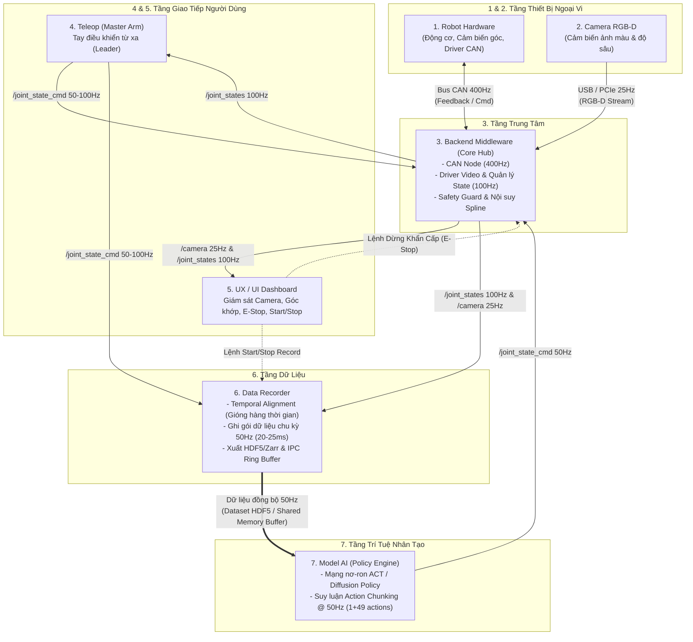
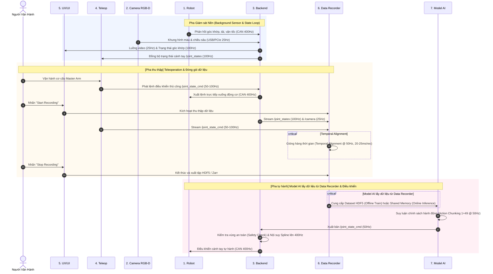

# KIẾN TRÚC HỆ THỐNG OPENARM CAN

> **Tài liệu đặc tả kiến trúc kỹ thuật hệ thống OpenArm CAN**  
> *Phiên bản:* 1.0.0  
> *Vai trò cốt lõi:* Backend Middleware làm Trung tâm điều phối (Core Hub), kết nối Robot CAN Bus (400 Hz), Camera RGB-D (25 Hz), Teleop Master Arm (50–100 Hz), UX/UI Dashboard, Data Recorder đồng bộ 50 Hz và Model AI Policy Engine (ACT/Diffusion Policy với 1+49 Action Chunking @ 50 Hz).

---

## 1. TỔNG QUAN HỆ THỐNG (SYSTEM OVERVIEW)

Hệ thống **OpenArm CAN** là nền tảng điều khiển cánh tay robot thời gian thực phục vụ thu thập dữ liệu thao tác khéo léo (teleoperation demonstration collection) và triển khai mô hình học tăng cường / học bắt chước (Imitation Learning: ACT, Diffusion Policy).

### Nguyên lý thiết kế cốt lõi:
1. **Backend Middleware là Hub Trung Tâm:** Mọi luồng dữ liệu phần cứng (CAN 400 Hz, Camera 25 Hz) và dữ liệu điều khiển (Teleop 50–100 Hz, Model AI 50 Hz) đều bắt buộc đi qua Backend. Không một module người dùng hay AI nào được can thiệp trực tiếp vào bus CAN phần cứng.
2. **Khử lệch pha tín hiệu (Zero-Phase-Shift Temporal Alignment):** Dữ liệu thu thập từ các thiết bị có tần số khác nhau (Camera 25 Hz, Góc khớp 100 Hz, Lệnh điều khiển 50–100 Hz) được Data Recorder gióng hàng thời gian chuẩn xác ở chu kỳ **50 Hz (20–25 ms/record)**. Model AI chỉ được học và suy luận dựa trên dữ liệu đã đồng bộ này.
3. **An toàn tuyệt đối (Safety Guard & Realtime Spline Interpolation):** Mọi lệnh điều khiển từ Model AI (50 Hz) hoặc Teleop đều được Backend kiểm tra giới hạn an toàn (Safety Check) và nội suy Spline làm mượt lên **400 Hz** trước khi nạp xuống driver động cơ qua CAN bus. Lệnh dừng khẩn cấp (E-Stop) có độ ưu tiên cao nhất, lập tức vô hiệu hóa chuyển động.

---

## 2. SƠ ĐỒ KIẾN TRÚC TỔNG THỂ (BLOCK DIAGRAM)



---

## 3. SƠ ĐỒ CHUỖI HOẠT ĐỘNG (SEQUENCE DIAGRAM)



---

## 4. CHI TIẾT TỪNG TẦNG THÀNH PHẦN (SYSTEM COMPONENT BREAKDOWN)

### 4.1. Tầng 1 & 2: Thiết Bị Ngoại Vi (Hardware & Peripherals Layer)
* **1. Robot Hardware:**
  * **Driver động cơ & Bộ mã hóa góc (Encoders):** Kết nối qua Bus CAN 2.0B / CAN-FD.
  * **Tần số giao tiếp:** Chu kỳ cố định **400 Hz** (\( \Delta t = 2.5\text{ ms} \)).
  * **Feedback từ Robot:** Vị trí góc khớp thực tế (\( q \)), vận tốc (\( \dot{q} \)), dòng điện/mô-men xoắn (\( \tau \)), trạng thái nhiệt độ và mã lỗi.
  * **Command gửi Robot:** Lệnh dòng điện (Torque), vị trí (Position) hoặc vận tốc (Velocity) cập nhật đều đặn mỗi 2.5 ms.
* **2. Camera RGB-D:**
  * Cảm biến thị giác thu nhận đồng thời luồng ảnh màu (Color) và bản đồ độ sâu (Depth).
  * Giao tiếp qua giao thức tốc độ cao: USB 3.0 / PCIe.
  * Tần số khung hình ổn định: **25 Hz** (\( \Delta t = 40\text{ ms} \)).

### 4.2. Tầng 3: Backend Middleware (Core Hub)
Backend là hạt nhân điều phối tập trung của toàn hệ thống, gồm 3 module con:
1. **CAN Node (400 Hz):**
   * Quản lý trực tiếp SocketCAN / CAN interface với chu kỳ thời gian thực cứng (Real-time hard deadline 2.5 ms).
   * Đọc packet feedback từ CAN bus, giải mã thành telemetry góc khớp.
   * Gửi frame CAN điều khiển đã qua bước kiểm tra an toàn và nội suy.
2. **Driver Video & Quản lý State (100 Hz):**
   * Thu nhận khung hình 25 Hz từ Camera RGB-D, đóng gói thành video stream phục vụ hiển thị UI và ghi dữ liệu.
   * Đọc phản hồi 400 Hz từ CAN Node, lọc và xuất bản topic chuẩn `/joint_states` với tần số chuẩn hóa **100 Hz** (\( \Delta t = 10\text{ ms} \)) cho UI, Teleop và Recorder.
3. **Safety Guard & Spline Interpolator:**
   * **Safety Guard (Kiểm tra an toàn):**
     * Kiểm tra giới hạn góc khớp (Soft/Hard Joint Limits).
     * Giới hạn vận tốc cực đại (\( \dot{q}_{\max} \)) và gia tốc cực đại (\( \ddot{q}_{\max} \)).
     * Phát hiện va chạm (Torque threshold jump) và phát hiện mất kết nối (Heartbeat Watchdog timeout 50 ms).
     * Tiếp nhận tín hiệu E-Stop từ UX/UI: Lập tức ngắt lệnh điều khiển, hãm phanh hoặc chuyển động cơ về chế độ damped/torque-off.
   * **Nội suy Spline (Cubic / Quintic Spline Interpolator):**
     * Nhận lệnh `/joint_state_cmd` từ Model AI (50 Hz) hoặc Teleop (50–100 Hz).
     * Tiến hành nội suy đa thức bậc 3 hoặc bậc 5 để làm mượt quỹ đạo, nâng xung từ 50 Hz lên **400 Hz** liên tục, chống giật (jerk minimization) trước khi đưa vào CAN Node.

### 4.3. Tầng 4 & 5: Giao Tiếp Người Dùng (User Interface & Teleoperation Layer)
* **4. Teleop (Master Arm / Leader Arm):**
  * Thiết bị điều khiển cánh tay chủ (Master/Leader) cho người vận hành trực tiếp thao tác.
  * Nhận topic `/joint_states` (100 Hz) từ Backend để đồng bộ vị trí ban đầu hoặc phản hồi lực (haptic feedback).
  * Xuất bản topic `/joint_state_cmd` với tần số **50–100 Hz** tới cả Backend (để điều khiển robot bám theo) và Data Recorder (để ghi nhận hành động mẫu).
* **5. UX/UI Dashboard:**
  * Giám sát thời gian thực: Hiển thị luồng video 25 Hz và biểu đồ trạng thái góc khớp 100 Hz.
  * Điều khiển trạng thái hệ thống:
    * **E-Stop (Dừng khẩn cấp):** Gửi tín hiệu ưu tiên cao nhất trực tiếp vào Backend.
    * **Start/Stop Record:** Gửi lệnh trực tiếp vào Data Recorder để bắt đầu hoặc kết thúc một episode thu thập mẫu dữ liệu.

### 4.4. Tầng 6: Data Recorder (Data Engine)
* **Thu thập đa kênh:**
  * `/joint_states` (100 Hz) từ Backend.
  * `/camera` (25 Hz) từ Backend.
  * `/joint_state_cmd` (50–100 Hz) từ Teleop.
* **Cơ chế Gióng hàng Thời gian (Temporal Alignment @ 50 Hz):**
  * Do các nguồn dữ liệu có chu kỳ bất đồng bộ (10 ms, 40 ms, 10–20 ms), Data Recorder sử dụng cơ chế timestamp window matching và nội suy tuyến tính để đồng bộ toàn bộ trạng thái và hành động về cùng một lưới thời gian cố định **50 Hz (20–25 ms/record)**.
* **Định dạng Lưu trữ & Truyền phát:**
  * **Offline Dataset:** Đóng gói thành file HDF5 (`.h5` / `.hdf5`) hoặc Zarr chuẩn LeRobot / ACT / Diffusion Policy.
  * **Online Inference:** Cung cấp Shared Memory Ring Buffer / IPC zero-copy cho Model AI khi chạy suy luận trực tiếp.

### 4.5. Tầng 7: Model AI (Policy Engine)
* **Kiến trúc mô hình:** Mạng nơ-ron chính sách học bắt chước (ACT - Action Chunking with Transformers hoặc Diffusion Policy).
* **Khử lệch pha (Zero-Phase-Shift):**
  * Mô hình nhận dữ liệu quan sát đã qua gióng hàng thời gian từ Data Recorder (Offline Dataset khi train; Shared Memory khi online test).
  * Tuyệt đối không đọc trực tiếp stream bất đồng bộ rời rạc từ Camera/CAN để tránh hiện tượng trễ pha tín hiệu làm sai lệch chính sách hành động.
* **Suy luận Action Chunking @ 50 Hz:**
  * Dự đoán chuỗi hành động chunking \( 1 + 49 = 50 \) bước (1 bước hiện tại + 49 bước tương lai).
  * Chu kỳ suy luận kích hoạt ở **50 Hz**.
  * Xuất bản `/joint_state_cmd` (50 Hz) ngược về Backend Middleware để kiểm tra an toàn và nội suy trước khi nạp xuống robot.

---

## 5. KHẾ ƯỚC TẦN SỐ VÀ GIAO THỨC (FREQUENCY & PROTOCOL CONTRACTS)

| Kênh Giao Tiếp | Nguồn phát | Đích nhận | Tần số / Chu kỳ | Định dạng / Nội dung |
| :--- | :--- | :--- | :--- | :--- |
| **CAN Feedback** | Robot Hardware | Backend (CAN Node) | **400 Hz** (2.5 ms) | CAN Frame (Joint pos, vel, effort, status) |
| **CAN Command** | Backend (CAN Node) | Robot Hardware | **400 Hz** (2.5 ms) | CAN Frame (Target torque / position / vel) |
| **Camera Stream** | Camera RGB-D | Backend (Video Driver)| **25 Hz** (40 ms) | Raw RGB (H×W×3) + Depth (H×W×1 uint16) |
| **`/joint_states`**| Backend | Teleop, UI, Recorder | **100 Hz** (10 ms) | Timestamp, `q_actual`, `dq_actual`, `effort` |
| **`/camera`** | Backend | UI, Recorder | **25 Hz** (40 ms) | Synced Video Frame (Color + Depth Packet) |
| **`/joint_state_cmd` (Teleop)** | Teleop | Backend, Recorder | **50–100 Hz** (10–20 ms)| Timestamp, `q_target`, `gripper_cmd` |
| **E-Stop** | UX/UI | Backend | Sự kiện (Ngay lập tức) | Khẩn cấp ngắt điện / chuyển safe mode |
| **Record Trigger** | UX/UI | Data Recorder | Sự kiện | `START_RECORD`, `STOP_RECORD` |
| **Temporal Record**| Data Recorder | HDF5 / Shm | **50 Hz** (20–25 ms) | Packet đồng bộ: Image + State + Action |
| **`/joint_state_cmd` (AI)** | Model AI | Backend | **50 Hz** (20 ms) | Action chunk (1+49 trajectory cmd) |

---

## 6. CƠ CHẾ GIÓNG HÀNG THỜI GIAN (TEMPORAL ALIGNMENT ALGORITHM)

Nhằm triệt tiêu độ lệch pha (phase misalignment) giữa các cảm biến:
1. **Clock Reference:** Sử dụng Monotonic System Clock chuẩn nano-giây làm mốc thời gian duy nhất cho mọi node.
2. **Buffer Window:** Data Recorder duy trì Sliding Window Ring Buffer cho mỗi nguồn (Camera, State, Teleop Cmd).
3. **50 Hz Tick Generator:** Bộ đếm nhịp phát tín hiệu mỗi 20.0 ms (\( t_k \)):
   - **Camera Frame:** Lấy khung hình gần nhất có timestamp \( \le t_k \) (độ trễ tối đa < 40 ms).
   - **Joint State:** Lấy nội suy tuyến tính giữa 2 mẫu state 100 Hz gần \( t_k \) nhất.
   - **Action Cmd:** Lấy lệnh điều khiển tương ứng tại nhịp \( t_k \).
4. **Đóng gói Dataset HDF5 chuẩn:**
   ```text
   episode_XXXXXX.hdf5
   ├── /observations
   │   ├── /images
   │   │   ├── /cam_high (N, H, W, 3) [uint8]
   │   │   └── /cam_wrist (N, H, W, 3) [uint8] (nếu có)
   │   ├── /depth (N, H, W) [uint16]
   │   ├── /qpos (N, 7) [float32] (Góc khớp 50Hz)
   │   └── /qvel (N, 7) [float32] (Vận tốc 50Hz)
   ├── /action (N, 7) [float32] (Lệnh điều khiển 50Hz)
   └── /metadata
       ├── timestamps (N,) [float64]
       ├── fps (50)
       └── duration_sec
   ```

---

## 7. CẤU TRÚC THƯ MỤC MÃ NGUỒN CHUẨN HOÁ

```text
openarm_can/
├── ARCHITECTURE.md                  # Bản đặc tả kiến trúc chi tiết (File này)
├── GEMINI.md                        # Ràng buộc và quy tắc code bất di bất dịch cho Agent
├── AGENTS.md                        # Quy tắc dành cho các hệ thống Agent / Copilot khác
├── .agents/
│   └── rules/
│       └── openarm_architecture_rules.md  # Rule tự động kích hoạt của Antigravity
│
├── common/                          # Giao thức & định nghĩa kiểu dữ liệu dùng chung
│   ├── constants.py                 # Khai báo tần số (400Hz, 100Hz, 50Hz, 25Hz)
│   ├── messages.py                  # Dataclass cho JointState, JointCmd, FramePacket
│   └── shared_memory.py             # Quản lý IPC Shared Memory Ring Buffer
│
├── backend/                         # Backend Middleware Core Hub
│   ├── can_node/                    # SocketCAN 400Hz Realtime Worker
│   ├── video_driver/                # Driver RGB-D Camera 25Hz
│   ├── state_manager/               # Quản lý và xuất bản /joint_states 100Hz
│   ├── safety/                      # Safety Guard, E-Stop logic, Limit checker
│   └── interpolator/                # Spline Interpolator (50Hz -> 400Hz)
│
├── teleop/                          # Module Master Arm (Leader)
│   ├── master_driver.py             # Đọc cảm biến Master Arm
│   └── teleop_node.py               # Xuất bản /joint_state_cmd (50-100Hz)
│
├── ui/                              # Giao diện UX/UI Dashboard
│   ├── dashboard_app.py             # Ứng dụng giao diện thời gian thực
│   ├── video_widget.py              # Hiển thị stream camera 25Hz
│   └── controls.py                  # Nút E-Stop, Start/Stop Recording
│
├── recorder/                        # Data Recorder Engine
│   ├── temporal_aligner.py          # Thuật toán gióng hàng thời gian 50Hz
│   ├── hdf5_writer.py               # Module ghi file HDF5 / Zarr
│   └── recorder_node.py             # Node quản trị session thu thập
│
└── model_ai/                        # Tác tử AI Policy (ACT / Diffusion)
    ├── policy/                      # Định nghĩa mạng nơ-ron ACT / Diffusion Policy
    ├── dataset/                     # Dataloader nạp trực tiếp từ HDF5 Recorder
    └── inference_node.py            # Node suy luận 1+49 action chunking @ 50Hz
```
