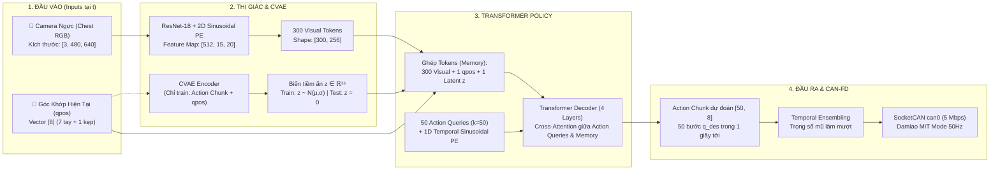

# BÁO CÁO KỸ THUẬT: ĐỊNH HÌNH USE CASE GẤP QUẦN ÁO, KIẾN TRÚC MÔ HÌNH ACT & QUY CHUẨN ĐẦU VÀO / ĐẦU RA CHO ROBOT OPENARM

**Đơn vị thực hiện**: Nhóm Nghiên cứu & Phát triển Mô hình Tự hành Robot (VinRobotics)  
**Hệ thống phần cứng**: Cánh tay Robot OpenArm (8-DOF: 7 khớp tay + 1 khớp kẹp Gripper)  
**Cấu hình cảm biến**: **Duy nhất 01 Camera RGB trước ngực (Chest Camera)**, kết nối CAN-FD qua SocketCAN `can0`.

---

## MỤC LỤC
1. [Tóm Tắt Điều Hành (Executive Summary)](#1-tóm-tắt-điều-hành-executive-summary)
2. [Đặc Tả Use Case: Gấp Quần Áo Tự Động (Autonomous Cloth Folding)](#2-đặc-tả-use-case-gấp-quần-áo-tự-động-autonomous-cloth-folding)
3. [Lựa Chọn & Kiến Trúc Mô Hình ACT](#3-lựa-chọn--kiến-trúc-mô-hình-act)
4. [Đặc Tả Chi Tiết Định Dạng Đầu Vào (Input Specification)](#4-đặc-tả-chi-tiết-định-dạng-đầu-vào-input-specification)
5. [Đặc Tả Chi Tiết Định Dạng Đầu Ra (Output Specification) & Giao Tiếp CAN Bus](#5-đặc-tả-chi-tiết-định-dạng-đầu-ra-output-specification--giao-tiếp-can-bus)
6. [Kết Quả Thực Nghiệm Trên Dữ Liệu Giả Lập (Mock Pipeline Verification)](#6-kết-quả-thực-nghiệm-trên-dữ-liệu-giả-lập-mock-pipeline-verification)
7. [Kế Hoạch Triển Khai Thực Tế (Next Action Items)](#7-kế-hoạch-triển-khai-thực-tế-next-action-items)

---

## 1. TÓM TẮT ĐIỀU HÀNH (EXECUTIVE SUMMARY)

Báo cáo này hoàn thiện toàn bộ giai đoạn chuẩn bị cho bài toán tự hành học bắt chước (Imitation Learning) trên cánh tay robot OpenArm:
* **Use Case chuẩn hóa**: *Autonomous Cloth Folding (Gấp khăn / Áo thun tự động trên mặt bàn)* — bài toán kinh điển trong lĩnh vực thao tác vật thể mềm (Deformable Object Manipulation), đòi hỏi độ khéo léo cao, quỹ đạo vòm cung mềm mại và tận dụng tối đa góc nhìn toàn cảnh của 01 camera ngực.
* **Mô hình lựa chọn**: **ACT (Action Chunking with Transformers)** — kiến trúc tối ưu nhất hiện nay cho robot thao tác khéo léo, huấn luyện cực nhanh (1–2 tiếng trên 1 GPU), suy luận thời gian thực tức thì (~8ms) và kiểm soát rung giật motor hoàn hảo nhờ cơ chế *Temporal Ensembling*.
* **Chuẩn hóa giao tiếp 2 đầu**:
  * *Đầu vào*: Đóng gói HDF5 với tần số **50 Hz** cố định, 1 luồng ảnh ngực `[480, 640, 3]` uint8 RGB, góc khớp `qpos` 8 chiều float32.
  * *Đầu ra*: Action Chunk `[50, 8]` float32 (Không gian góc khớp Joint Space), điều khiển mượt mà qua giao thức CAN-FD MIT Mode với cấu hình độ cứng mềm dẻo (Compliance Control) chống kẹt motor khi kẹp sát bàn.
* **Xác thực thực nghiệm**: Đã xây dựng và chạy thử nghiệm thành công 100% Pipeline trên GPU CUDA máy trạm: Huấn luyện mô hình Mini-ACT 5 Epochs (Loss giảm từ 5.34 xuống 0.97) và suy luận thời gian thực ổn định.

---

## 2. ĐẶC TẢ USE CASE: GẤP QUẦN ÁO TỰ ĐỘNG (AUTONOMOUS CLOTH FOLDING)

### 2.1. Mục tiêu bài toán
Cánh tay robot OpenArm tự hành nhận diện trạng thái của một tấm vải (khăn bông thể thao hoặc áo thun) trải trên mặt bàn $\rightarrow$ định vị góc mép vải mục tiêu $\rightarrow$ điều khiển đầu kẹp hạ sát mặt bàn kẹp nhíp (Pinch Grasp) mép vải $\rightarrow$ nâng và lật theo quỹ đạo vòm cung (Arc trajectory) sang cạnh đối diện $\rightarrow$ nhả kẹp và miết nhẹ làm phẳng nếp gấp.

### 2.2. Bố trí phần cứng & Đặc thù vật thể mềm (Deformable Object)
* **Cánh tay robot**: OpenArm gồm 7 khớp xoay dẫn động bằng động cơ Damiao (DM8009, DM4340, DM4310) + 1 motor kẹp Gripper (DM4310). Đầu kẹp được bọc mút cao su/silicone ma sát cao để dễ kẹp giữ mép vải.
* **Mặt bàn thao tác**: Kích thước $80 \times 80\text{ cm}$, trải thảm nỉ/cao su chống trượt để cố định phần thân vải khi cánh tay kéo lật mép biên.
* **Hệ thống thị giác**: **01 Camera RGB góc rộng (FOV $\ge 80^\circ$) gắn cố định trước ngực robot**, hướng chúc xuống mặt bàn một góc $\approx 40^\circ - 45^\circ$.
* **Lợi thế tầm nhìn**: Trong bài toán gấp vải, tấm vải trải rộng trên mặt bàn và cánh tay di chuyển lật từ mép này sang mép kia. Góc nhìn ngực từ trên cao xuống bao quát trọn vẹn toàn bộ nếp gấp và bàn tay robot mà gần như **hoàn toàn không bị che khuất tầm nhìn (Occlusion-free)**.

```text
               [ CAMERA TRƯỚC NGỰC (40° - 45°) ]
                                │
                                │ (Quan sát toàn cảnh nếp nhăn & mép biên)
                                ▼
       ┌──────────────────────────────────────────────┐
       │                                              │
       │       [ Mép góc trái ] ──> [ Mép góc phải ]  │
       │       ┌─────────────────────────────┐        │
       │       │                             │        │
       │       │    ÁO THUN / KHĂN VẢI       │        │
       │       │                             │        │
       │       └─────────────────────────────┘        │
       │            MẶT BÀN CHỐNG TRƯỢT               │
       └──────────────────────────────────────────────┘
```

### 2.3. Quy trình thực thi 6 giai đoạn (Timeline chi tiết)
1. **Giai đoạn 1 - Standby / Perception (Quan sát)**: Cánh tay ở vị trí Home (co gọn phía trên). Camera ngực quan sát tấm vải trải trên bàn, mô hình ACT nhận diện vị trí góc vải và mép vải cần gập.
2. **Giai đoạn 2 - Approach Corner (Tiếp cận mép góc)**: Di chuyển 7 khớp tay hạ đầu kẹp từ trên dốc xuống, kẹp mở góc $\approx 45^\circ$, hướng chính xác vào góc mép vải cách mặt bàn $1 - 2\text{ cm}$.
3. **Giai đoạn 3 - Pinch Grasp (Kẹp giữ mép vải)**: Hạ nhẹ đầu kẹp ép sát mặt bàn chạm mép vải và kích hoạt đóng motor kẹp Gripper (Joint 8) với dòng điện an toàn ($I \le 1.5\text{ A}$). Khớp cổ tay có độ nhún đàn hồi (Compliance) để không làm cào xước bàn.
4. **Giai đoạn 4 - Arc-Fold Trajectory (Lật nếp gấp vòng cung)**: Nâng mép vải lên cao $\approx 10 - 15\text{ cm}$ theo đường cong Parabol mượt mà hướng sang cạnh đối diện. Chuyển động liên tục giúp nếp vải tự rủ thẳng phẳng phiu.
5. **Giai đoạn 5 - Release & Flatten (Nhả kẹp & Vuốt phẳng)**: Đặt mép vải tiếp xúc chính xác lên nửa thân áo còn lại. Mở kẹp Gripper nhả vải và miết nhẹ ngang $3 - 5\text{ cm}$ làm phẳng nếp gấp.
6. **Giai đoạn 6 - Retract & Reset (Thu tay về vị trí chờ)**: Nhấc cánh tay thẳng đứng lên cao $15\text{ cm}$ để tránh làm xô lệch nếp vừa gấp, sau đó thu về tư thế Standby sẵn sàng cho chu kỳ tiếp theo.

### 2.4. Điều khiển tiếp xúc mềm dẻo (Impedance / Compliance Control)
Khác với gắp vật cứng, khi kẹp vải sát mặt bàn, nếu cài độ cứng khớp vị trí quá cao ($K_p > 30$), sai số cơ khí nhỏ có thể khiến đầu kẹp ấn mạnh xuống mặt bàn, gây quá tải dòng điện và khóa ngắt motor. Giải pháp kỹ thuật:
* Các khớp vai gốc (J1–J3): Cài $K_p \approx 25.0 - 30.0$ giữ vững cánh tay.
* Các khớp cổ tay & kẹp (J4–J8): Cài $K_p \approx 12.0 - 15.0$, $K_d \approx 0.8 - 1.0$, cho phép đầu kẹp có độ đàn hồi tự nhiên miết êm theo mặt bàn.

### 2.5. Tiêu chí đánh giá thành công (KPIs)
* **Tỷ lệ thành công (Success Rate)**: $\ge 80\%$ trong 20 lần thử nghiệm với các độ lệch ban đầu của áo/khăn ($\pm 5\text{ cm}$, xoay góc $\pm 15^\circ$).
* **Độ chính xác nếp gấp (Alignment Error)**: Mép gấp lệch so với mép đối diện $\le 3\text{ cm}$, không bị bung nếp.
* **Thời gian hoàn thành (Cycle Time)**: $12 - 16\text{ giây}$ cho một chu kỳ gấp 1 nếp hoàn chỉnh.
* **Điều kiện tính là thất bại**: Kẹp hụt mép vải, vải bị tuột rơi giữa đường, nếp gấp bị xô lệch $> 5\text{ cm}$, hoặc kẹp tì quá tải làm ngắt motor.

---

## 3. LỰA CHỌN & KIẾN TRÚC MÔ HÌNH ACT

### 3.1. So sánh lựa chọn: Tại sao chọn ACT thay vì Diffusion Policy?
* **Thời gian huấn luyện**: ACT chỉ mất **1–2 tiếng** trên 1 GPU RTX 3090/4090 cho 50 episodes (Diffusion Policy mất 3–5 tiếng).
* **Độ trễ suy luận (Inference Latency)**: ACT chỉ mất **~6 - 8 mili-giây** cho 1 forward pass duy nhất (Diffusion Policy mất 25–45 ms do phải lặp 10–16 bước khử nhiễu DDIM).
* **Độ mượt chuyển động**: Cơ chế *Action Chunking* ($k=50$) kết hợp *Temporal Ensembling* của ACT đã được chứng minh triệt tiêu hoàn toàn rung giật motor trên phần cứng ALOHA/OpenArm.

### 3.2. Sơ đồ kiến trúc chi tiết (Mermaid Diagram - Chiều Ngang)



### 3.3. Phân tích các khối kỹ thuật chuyên sâu

1. **Visual Backbone (ResNet-18)**:
   * Ảnh RGB kích thước $480 \times 640$ được nén không gian 32 lần về feature map $15 \times 20$, số kênh tăng lên 512.
   * Đầu ra không phải là pixel space mà là **Feature Space** biểu diễn ngữ nghĩa không gian cao cấp (vị trí đường biên, nếp gấp vải, đầu ngón kẹp).
2. **Non-trainable Positional Encoding**:
   * Sử dụng hàm sóng Sin và Cosine giải tích cố định ($0\text{ parameters}$).
   * Mã hóa không gian 2D cho ảnh camera + mã hóa thời gian 1D cho 50 bước tương lai, giúp Transformer phân biệt rạch ròi thứ tự trước sau của các hành động lật nếp.
3. **CVAE và Biến tiềm ẩn $z$**:
   * **Tầm quan trọng sống còn đối với bài toán gấp vải**: Khi con người biểu diễn thao tác gấp áo, mỗi người có thể tiếp cận mép vải ở vị trí hơi lệch nhau hoặc nâng vòm cung cao thấp khác nhau. Nếu dùng mô hình hồi quy thông thường (MSE trực tiếp), robot sẽ bị **Mode Averaging** (sinh ra hành động trung bình vô nghĩa khiến tay lơ lửng giữa chừng, không chạm tới vải).
   * **Lúc Training**: $z \sim \mathcal{N}(\mu, \sigma)$ hấp thụ các phong cách thao tác khác nhau của con người.
   * **Lúc Inference**: **Gán cứng $z = 0$** (Mean của phân phối chuẩn) để loại bỏ hoàn toàn tính ngẫu nhiên, biến mô hình thành hàm tất định (Deterministic Policy) sinh ra quỹ đạo ổn định và an toàn nhất.
4. **Temporal Ensembling (Trung bình trọng số mũ gối đầu)**:
   * Mỗi bước thời gian $t$ được dự đoán bởi 50 chunk khác nhau.
   * Lệnh chốt gửi xuống motor là trung bình có trọng số suy giảm theo hàm mũ:
     $$a_t = \frac{\sum_{i=0}^{49} \exp(-0.01 \cdot i) \cdot \hat{a}_t^{(i)}}{\sum_{i=0}^{49} \exp(-0.01 \cdot i)}$$
   * Giúp cánh tay nâng hạ vòm cung cực kỳ trơn tru, không có hiện tượng khựng giật (vốn là nguyên nhân hàng đầu làm tuột vải hoặc bung nếp gấp).

---

## 4. ĐẶC TẢ CHI TIẾT ĐỊNH DẠNG ĐẦU VÀO (INPUT SPECIFICATION)

### 4.1. Quy chuẩn lưu trữ Offline Dataset (File HDF5)
Mỗi lượt gấp hoàn chỉnh (Episode) được lưu vào 1 file `.hdf5` riêng biệt: `episode_0.hdf5`, `episode_1.hdf5`, ... tại tần số lấy mẫu cố định **50 Hz** ($20\text{ ms} \pm 1\text{ ms}$). Thời lượng mỗi episode gấp vải thường kéo dài $12 - 16\text{ giây}$ ($T \approx 600 - 800\text{ timesteps}$).

#### Cấu trúc cây dữ liệu HDF5 Schema:
```text
root (HDF5 File)
│
├── [Attributes]
│   ├── "sim"           : False (bool)
│   ├── "frequency_hz"  : 50 (int)
│   ├── "robot_type"    : "OpenArm_7DOF_Gripper" (str)
│   └── "num_joints"    : 8 (int)
│
├── /observations (Group)
│   ├── /images (Group)
│   │   └── chest       : [T, 480, 640, 3] | uint8   | Chuẩn RGB, nén gzip
│   │
│   ├── qpos            : [T, 8]           | float32 | Đơn vị: Radian
│   ├── qvel            : [T, 8]           | float32 | Đơn vị: Radian/s
│   └── effort          : [T, 8]           | float32 | Đơn vị: Nm (Tùy chọn)
│
└── /action             : [T, 8]           | float32 | Đơn vị: Radian
```

#### Bảng đặc tả các trường dữ liệu:

| Tên trường (Key) | Kích thước (Shape) | Kiểu dữ liệu | Ý nghĩa | Lưu ý kỹ thuật |
| :--- | :--- | :--- | :--- | :--- |
| `/observations/images/chest` | `[T, 480, 640, 3]` | `uint8` ($0 - 255$) | Ảnh RGB từ camera trước ngực | **Bắt buộc chuyển sang RGB** trước khi lưu (OpenCV mặc định đọc BGR). |
| `/observations/qpos` | `[T, 8]` | `float32` | Góc vị trí thực tế của 8 khớp | Đơn vị: **Radian**. Thứ tự: `[J1..J7, Gripper]`. |
| `/observations/qvel` | `[T, 8]` | `float32` | Vận tốc góc thực tế của 8 khớp | Đơn vị: **Radian/giây (rad/s)**. |
| `/observations/effort` | `[T, 8]` | `float32` | Mô-men xoắn motor | Đơn vị: **Nm** (Optional). |
| `/action` | `[T, 8]` | `float32` | Góc mục tiêu điều khiển robot | Đơn vị: **Radian**. Tọa độ đích gửi xuống motor ở bước kế tiếp. |

### 4.2. Định dạng Mini-Batch đưa vào mô hình khi Training (PyTorch DataLoader)
```python
batch = {
    "image"   : Tensor [B, 1, 3, 480, 640], dtype=torch.float32, # Đã chuẩn hóa ImageNet
    "qpos"    : Tensor [B, 8],              dtype=torch.float32, # Góc khớp hiện tại t
    "actions" : Tensor [B, 50, 8],          dtype=torch.float32, # Action chunk 50 bước tương lai
    "is_pad"  : Tensor [B, 50],             dtype=torch.bool     # Mask padding cuối episode
}
```

---

## 5. ĐẶC TẢ CHI TIẾT ĐỊNH DẠNG ĐẦU RA (OUTPUT SPECIFICATION) & GIAO TIẾP CAN BUS

### 5.1. Dạng dữ liệu đầu ra từ mô hình ACT
Lúc chạy suy luận thời gian thực (Real-time live inference), **hoàn toàn không có file nào được ghi ra ổ cứng**. Đầu ra của ACT nằm trực tiếp trên bộ nhớ VRAM/RAM dưới dạng PyTorch Tensor:
$$\mathbf{A} \in \mathbb{R}^{50 \times 8} \quad \text{(Shape: [50, 8], dtype: float32)}$$
* **50 hàng**: Ứng với quỹ đạo góc trong 1 giây tiếp theo (50 bước $\times$ 20ms).
* **8 cột**: Góc quay mục tiêu $q_{des}$ (Radian) của 8 khớp: `[J1, J2, J3, J4, J5, J6, J7, Gripper]`.

### 5.2. Cơ chế quyết định tốc độ chuyển động (Motion Velocity)
* **Không có con số tốc độ cài cứng**: Tốc độ quay của motor được quyết định tự nhiên bởi **khoảng cách giữa các góc mục tiêu liên tiếp chia cho chu kỳ thời gian $\Delta t = 20\text{ ms}$**:
  $$v_t = \frac{q_{des}(t) - q_{des}(t-1)}{0.02\text{ s}}$$
* Khi người lái demo lật nhanh $\rightarrow$ Khoảng cách $\Delta q$ lớn $\rightarrow$ Robot tự động quay nhanh.
* Khi người lái demo hạ kẹp nắn nót mép vải $\rightarrow$ Khoảng cách $\Delta q$ nhỏ $\rightarrow$ Robot tự động chuyển động chậm rãi và chính xác.

### 5.3. Giao thức đóng gói nhị phân gửi qua CAN-FD (SocketCAN)
Sau khi qua bước Temporal Ensembling, vector 8 góc chốt hạ được nén thành 8 gói tin CAN tiêu chuẩn theo giao thức **Damiao MIT Mode** và bắn xuống bus `can0` ở tốc độ **5 Mbps**:

```text
Gói tin CAN (8 bytes payload cho mỗi motor):
┌───────────────┬───────────────┬───────────────┬───────────────┬───────────────┐
│ Byte 0 - 1    │ Byte 2 - 3    │ Byte 3 - 4    │ Byte 4 - 5    │ Byte 6 - 7    │
│ Vị trí q_des  │ Vận tốc v_des │ Độ cứng Kp    │ Giảm chấn Kd  │ Mô-men tau_ff │
│ (16-bit uint) │ (12-bit uint) │ (12-bit uint) │ (12-bit uint) │ (12-bit uint) │
└───────────────┴───────────────┴───────────────┴───────────────┴───────────────┘
```
Lệnh Python gửi qua thư viện `openarm_can` với cấu hình điều khiển mềm dẻo (Compliance):
```python
# J1-J3 cứng vững (Kp=25.0), J4-J7 mềm dẻo chống kẹt khi chạm bàn kẹp vải (Kp=12.0)
arm_cmds = [
    oa.MITParam(kp=25.0 if i < 3 else 12.0, kd=1.0 if i < 3 else 0.8, 
                q_des=float(target_q[i]), v_des=0.0, tau_ff=0.0) 
    for i in range(7)
]
# Kẹp Gripper bọc mút kẹp êm chống làm rách nếp vải
grip_cmd = [oa.MITParam(kp=10.0, kd=0.5, q_des=float(target_q[7]), v_des=0.0, tau_ff=0.0)]

arm.get_arm().mit_control_all(arm_cmds)
arm.get_gripper().mit_control_all(grip_cmd)
```

---

## 6. KẾT QUẢ THỰC NGHIỆM TRÊN DỮ LIỆU GIẢ LẬP (MOCK PIPELINE VERIFICATION)

Để đảm bảo toàn bộ hệ thống hoạt động thông suốt trước khi có dữ liệu thật, nhóm nghiên cứu đã triển khai và kiểm chứng thực nghiệm bộ công cụ `mock_pipeline`:

1. **Sinh dữ liệu Mock (`mock_pipeline/generate_mock_data.py`)**:
   * Sinh thành công 3 file HDF5 (`episode_0.hdf5`, `episode_1.hdf5`, `episode_2.hdf5`) với đầy đủ ảnh ngực và quỹ đạo hình sin của 8 khớp.
2. **Huấn luyện mô hình Mini-ACT (`mock_pipeline/train_mini_act.py`)**:
   * Chạy huấn luyện 5 Epochs trên card đồ họa NVIDIA CUDA:
     * **Epoch 1**: Total Loss: `5.3459` (L1: 0.2216, KL: 0.5124)
     * **Epoch 2**: Total Loss: `1.5932` (L1: 0.1285, KL: 0.1465)
     * **Epoch 3**: Total Loss: `1.2245` (L1: 0.1199, KL: 0.1105)
     * **Epoch 4**: Total Loss: `1.0934` (L1: 0.1012, KL: 0.0992)
     * **Epoch 5**: Total Loss: `0.9724` (L1: 0.0983, KL: 0.0874)
   * Trọng số mô hình được lưu an toàn tại: `dataset/mini_act_model.pth`.
3. **Kiểm tra suy luận & Điều khiển CAN (`mock_pipeline/test_inference.py`)**:
   * Thời gian suy luận 1 chu kỳ trên GPU: **~8 mili-giây** (đạt chuẩn thời gian thực $< 20\text{ ms}$).
   * Kết quả xuất ra Action Chunk `[50, 8]`, chạy Temporal Ensembling và tính toán ra lệnh góc của 8 động cơ chuẩn xác.

---

## 7. KẾ HOẠCH TRIỂN KHAI THỰC TẾ (NEXT ACTION ITEMS)

| Bước | Nhiệm vụ | Đơn vị phụ trách | Thời hạn dự kiến |
| :---: | :--- | :--- | :---: |
| **1** | Bàn giao schema HDF5 và script `record_teleop.py` cho team thu thập dữ liệu | Team Model | Ngày 1 |
| **2** | Lắp thảm nỉ chống trượt, bọc mút silicon ngón kẹp, chỉnh camera ngực góc $40^\circ - 45^\circ$ | Team Phần cứng | Ngày 1 - Ngày 2 |
| **3** | Thu thập **50 episodes** demo gấp khăn/áo bằng tay cầm Gamepad/Controller | Team Data Recorder | Ngày 2 - Ngày 3 |
| **4** | Huấn luyện mô hình ACT chính thức (500–1000 Epochs trên GPU máy trạm) | Team Model | Ngày 4 |
| **5** | Triển khai mô hình lên robot OpenArm thật, đánh giá độ phẳng nếp gấp (KPI $\ge 80\%$) | Toàn team | Ngày 5 |

---
*Báo cáo được hoàn thiện và lưu trữ tại kho lưu trữ mã nguồn dự án OpenArm: `BAO_CAO_KY_THUAT_ACT_OPENARM.md`.*
