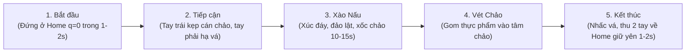

# HƯỚNG DẪN QUY CHUẨN THU THẬP DỮ LIỆU RGB-D CHO ROBOT BIMANUAL OPENARM (16-DOF)
> **Tác vụ mục tiêu**: Xào Nấu / Chế Biến Thực Phẩm Tự Động Hai Tay (Autonomous Bimanual Cooking & Stir-Frying)  
> **Tài liệu bàn giao kỹ thuật cho Team Thu Thập Dữ Liệu (Teleoperation / Data Recorder)**  
> **Mục tiêu**: Đóng gói dữ liệu thao tác hai tay chuẩn định dạng HDF5 để huấn luyện trực tiếp vào mô hình AI **ACT (Action Chunking with Transformers)**.

---

## 📌 TÓM TẮT NHANH (QUY TẮC BẮT BUỘC)

| Hạng mục | Quy định bắt buộc | Giải thích lý do |
| :--- | :--- | :--- |
| **Tác vụ thao tác** | **Xào Nấu Hai Tay (Bimanual Cooking & Stir-Frying)** | Tay trái giữ/cố định/xốc cán chảo, tay phải cầm vá/xẻng đảo lật thức ăn. |
| **Định dạng file** | **HDF5 (`.hdf5`)**, 1 file cho mỗi episode | Chuẩn robotics quốc tế (ALOHA, LeRobot), nạp mini-batch cực nhanh vào GPU. |
| **Tần số lấy mẫu** | **$50\text{ Hz}$** cố định (chu kỳ $20\text{ ms} \pm 1\text{ ms}$) | Khớp với tần số điều khiển CAN bus và chunk $50\text{ bước} = 1.0\text{s}$ của ACT. |
| **Độ phân giải ảnh** | **$640 \times 480$** (Tỷ lệ $4:3$) cho CẢ RGB VÀ DEPTH | Đảm bảo bao quát toàn bộ vùng bếp và 2 cánh tay; tối ưu dung lượng đĩa. |
| **Căn chỉnh Camera** | **BẮT BUỘC bật `align_to_color`** | Tọa độ pixel $(u, v)$ của ảnh màu và độ sâu phải trùng khớp $100\%$. |
| **Hệ màu RGB** | **Chuẩn RGB** (Không được lưu BGR của OpenCV) | Nếu lưu BGR thì màu sắc nguyên liệu bị đảo lộn (cà chua đỏ thành xanh), mô hình hỏng. |
| **Kênh Depth** | Kiểu dữ liệu **`uint16`**, đơn vị **milimét (mm)** | Tiết kiệm $50\%$ dung lượng so với float32, giữ trọn độ chính xác mm khi xẻng tiếp xúc chảo. |
| **Thứ tự 16 khớp** | **8 Khớp Tay Trái trước $\to$ 8 Khớp Tay Phải sau** | Khớp với driver SocketCAN và mạng nơ-ron điều khiển 2 tay. |
| **Quy tắc dừng** | **Nhấc vá, thu 2 tay về vị trí Home ($q=\mathbf{0}$) và giữ yên 1-2s** | Giúp mô hình học dấu hiệu dừng tự nhiên (Implicit Termination). |

---

## 1. YÊU CẦU CHI TIẾT VỀ MÔI TRƯỜNG BẾP & CAMERA RGB-D

1. **Khớp kích thước Pixel giữa RGB và Depth**:
   * Cả 2 kênh màu (RGB) và chiều sâu (Depth) **bắt buộc phải có cùng kích thước: $640 \times 480$**.
   * Cấu hình trên SDK của camera (RealSense D435/D405) về độ phân giải $640 \times 480$.
2. **Căn chỉnh phần cứng (Hardware Spatial Alignment)**:
   * Mắt kính RGB và cảm biến hồng ngoại Depth nằm cách nhau một khoảng vật lý. 
   * **Bắt buộc trong code ghi nhận phải gọi hàm căn chỉnh**:
     * *Intel RealSense*: `align = rs.align(rs.stream.color)` $\to$ `frames = align.process(frames)`
   * *Hậu quả nếu quên*: Tọa độ đầu vá xẻng sẽ lệch $3-5\text{ cm}$, robot đâm mạnh xẻng vào đáy chảo gây kẹt động cơ hoặc nhấc xẻng trên không không chạm tới thức ăn.
3. **Môi trường, Ánh sáng & Bề mặt Bếp**:
   * Cự ly từ camera ngực đến mặt bếp/lòng chảo nằm trong khoảng **$0.3\text{ m} - 1.0\text{ m}$ (300 - 1000 mm)**.
   * **Bề mặt chảo & bếp**: Sử dụng chảo chống dính có lòng chảo màu xám mờ hoặc đen nhám (matte finish). **Tuyệt đối không dùng chảo inox sáng loáng tráng gương hoặc mặt bếp kính bóng phản xạ cao** vì tia hồng ngoại sẽ bị phản xạ gây mù độ sâu (Hole Depth = 0).
   * **Ánh sáng**: Tránh ánh nắng mặt trời chiếu trực tiếp vào khu vực nấu (tia UV/hồng ngoại ngoài trời làm chói cảm biến Depth).
   * **Nguyên liệu thực nghiệm**: Khuyên dùng thực phẩm mô phỏng (hạt nhựa màu, bọt silicone cắt khúc) hoặc rau củ/thịt thái hạt lựu có màu tương phản tốt với lòng chảo.

---

## 2. QUY ƯỚC THỨ TỰ 16 ĐỘNG CƠ (16-DOF BIMANUAL)

Mỗi vector góc `qpos` và `action` có đúng **16 phần tử kiểu `float32` (đơn vị: Radian)**:

$$\mathbf{q} = \big[ \underbrace{q_0, q_1, q_2, q_3, q_4, q_5, q_6, q_7}_{\text{8 Motor Tay Trái (Left Arm - Giữ Chảo)}}, \quad \underbrace{q_8, q_9, q_{10}, q_{11}, q_{12}, q_{13}, q_{14}, q_{15}}_{\text{8 Motor Tay Phải (Right Arm - Đảo Vá Xào)}} \big]$$

| Index | Tên Khớp | CAN ID | Chức Năng Trong Tác Vụ Xào Nấu | Đơn vị |
| :---: | :--- | :---: | :--- | :---: |
| `0` | **Left_J1_Base** | `0x01` | Xoay đế ngang tay trái đến cán chảo | Radian |
| `1` | **Left_J2_Shoulder** | `0x02` | Nâng / hạ cánh tay trái theo độ cao cán chảo | Radian |
| `2` | **Left_J3_Elbow_Pitch** | `0x03` | Gập khuỷu tay trái duy trì cự ly | Radian |
| `3` | **Left_J4_Elbow_Roll** | `0x04` | Xoay trục bắp tay trái định vị cán chảo | Radian |
| `4` | **Left_J5_Wrist_Pitch** | `0x05` | Gập cổ tay trái điều chỉnh độ chúc chảo | Radian |
| `5` | **Left_J6_Wrist_Roll** | `0x06` | Nghiêng cổ tay trái (xốc nhẹ lòng chảo) | Radian |
| `6` | **Left_J7_Wrist_Yaw** | `0x07` | Xoay tròn cổ tay trái cân bằng chảo | Radian |
| `7` | **Left_J8_Gripper** | `0x08` | Kẹp nhíp trái: Khóa chặt cán chảo | Radian |
| `8` | **Right_J1_Base** | `0x21` | Xoay đế ngang tay phải đưa vá vào lòng chảo | Radian |
| `9` | **Right_J2_Shoulder** | `0x22` | Nâng / hạ vai phải điều phối độ sâu xẻng xào | Radian |
| `10` | **Right_J3_Elbow_Pitch**| `0x23` | Gập khuỷu tay phải tạo lực đẩy đảo thức ăn | Radian |
| `11` | **Right_J4_Elbow_Roll** | `0x24` | Xoay trục bắp tay phải dẫn hướng vòng elip | Radian |
| `12` | **Right_J5_Wrist_Pitch**| `0x25` | Gập cổ tay phải: Miết lưỡi vá sát lòng cong chảo | Radian |
| `13` | **Right_J6_Wrist_Roll** | `0x26` | Lật cổ tay phải: Hất ngược thực phẩm lên | Radian |
| `14` | **Right_J7_Wrist_Yaw** | `0x27` | Xoay tròn cổ tay phải: Vét quanh thành chảo | Radian |
| `15` | **Right_J8_Gripper** | `0x28` | Kẹp nhíp phải: Khóa chặt cán vá xào | Radian |

---

## 3. CẤU TRÚC FILE HDF5 TIÊU CHUẨN

```text
root (episode_XX.hdf5)
├── [Attributes]
│   ├── "sim"               : False (bool)
│   ├── "frequency_hz"      : 50 (int)
│   ├── "robot_type"        : "OpenArm_Bimanual_16DOF" (str)
│   ├── "task_name"         : "bimanual_cooking_stir_frying" (str)
│   ├── "num_joints"        : 16 (int)
│   ├── "depth_scale"       : 0.001 (float) — 1 đơn vị uint16 = 1 mm
│   └── "depth_range_m"     : [0.2, 1.2] (float array)
│
├── /observations
│   ├── /images
│   │   ├── chest_rgb       : [T, 480, 640, 3] | uint8   | Ảnh màu chuẩn RGB (0 - 255)
│   │   └── chest_depth     : [T, 480, 640]    | uint16  | Bản đồ độ sâu Depth Z (mm: 0 - 65535)
│   ├── qpos                : [T, 16]          | float32 | Góc vị trí thực tế 16 motor (Rad)
│   ├── qvel                : [T, 16]          | float32 | Vận tốc tức thời 16 motor (Rad/s)
│   └── effort              : [T, 16]          | float32 | Mô-men xoắn thực tế 16 motor (Nm)
│
└── /action                 : [T, 16]          | float32 | Góc mục tiêu bước kế tiếp t+1 (Rad)
```

---

## 4. QUY TRÌNH THỰC HIỆN 1 EPISODE CHUẨN (THAO TÁC XÀO NẤU MẪU)



1. **Bước 1: Tư thế chuẩn bị (Home Position)**
   * Người điều khiển hoặc script đưa 2 tay robot về vị trí Home ban đầu ($q_{\text{home}} = \mathbf{0}$) và giữ yên trong $1 - 2\text{ giây}$ (50 - 100 timesteps).
2. **Bước 2: Tiếp cận & Kẹp dụng cụ (Approach & Grip)**
   * Tay trái vươn tới cán chảo và siết kẹp giữ chắc cán chảo.
   * Tay phải đưa vá xào từ trên cao hạ nhẹ nhàng xuống lòng chảo, mũi xẻng tiếp xúc nhẹ với đáy chảo.
3. **Bước 3: Thực hiện chu trình xào đảo (Stir-Frying Cycle)**
   * Thực hiện động tác đảo thức ăn liên tục trong $10 - 15\text{ giây}$ ở nhịp điệu đều đặn:
     * Đẩy xẻng trượt sát mặt cong lòng chảo, xúc nguyên liệu từ đáy lên.
     * Nâng nhẹ và lật cổ tay để đảo đều thực phẩm.
     * Tay trái giữ vững hoặc nghiêng nhẹ chảo đồng pha để thực phẩm dồn lại.
4. **Bước 4: Vét chảo gom thực phẩm (Scraping & Gathering)**
   * Dùng đầu xẻng lướt một vòng cung quanh thành chảo gom toàn bộ thức ăn dính ở thành về trung tâm chảo.
5. **Bước 5: Kết thúc và Dừng tự nhiên (Implicit Termination)**
   * Nhấc đầu xẻng xào lên cách mặt chảo $8 - 10\text{ cm}$.
   * Thu đồng thời cả 2 cánh tay về vị trí Home ($q_{\text{home}} = \mathbf{0}$) và **giữ yên tuyệt đối trong $1 - 2\text{ giây}$**.
   * Bấm dừng ghi dữ liệu.

---

## 5. CÂY THƯ MỤC LƯU TRỮ KHUYẾN NGHỊ

```text
dataset/real_cooking_stir_fry/
├── stats/
│   └── dataset_stats.pkl            # Thống kê mean/std sau khi quét dữ liệu
├── episode_0000.hdf5
├── episode_0001.hdf5
├── ...
└── episode_0049.hdf5                # Khuyến nghị tối thiểu 50 episodes mẫu
```

---

## 6. LỆNH VẬN HÀNH THU THẬP & KIỂM TRA

```bash
# 1. Ghi dữ liệu 1 episode xào nấu thực tế (Tự động dừng sau 25s hoặc bấm Ctrl+C)
python3 sim/data_recorder.py --episode episode_0000 --output_dir dataset/real_cooking_stir_fry

# 2. Kiểm định tính hợp lệ của file vừa ghi
python3 sim/validate_dataset.py dataset/real_cooking_stir_fry/episode_0000.hdf5
```
