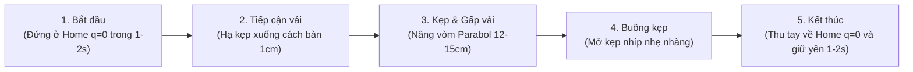

# HƯỚNG DẪN QUY CHUẨN THU THẬP DỮ LIỆU RGB-D CHO ROBOT BIMANUAL OPENARM (16-DOF)
> **Tài liệu bàn giao kỹ thuật cho Team Thu Thập Dữ Liệu (Teleoperation / Data Recorder)**  
> **Mục tiêu**: Đóng gói dữ liệu thao tác hai tay chuẩn định dạng HDF5 để huấn luyện trực tiếp vào mô hình AI **ACT (Action Chunking with Transformers)**.

---

## 📌 TÓM TẮT NHANH (QUY TẮC BẮT BUỘC)

| Hạng mục | Quy định bắt buộc | Giải thích lý do |
| :--- | :--- | :--- |
| **Định dạng file** | **HDF5 (`.hdf5`)**, 1 file cho mỗi episode | Chuẩn robotics quốc tế (ALOHA, LeRobot), nạp batch cực nhanh. |
| **Tần số lấy mẫu** | **$50\text{ Hz}$** cố định (chu kỳ $20\text{ ms} \pm 1\text{ ms}$) | Khớp với tần số điều khiển CAN bus và chunk $50\text{ bước} = 1.0\text{s}$ của ACT. |
| **Độ phân giải ảnh** | **$640 \times 480$** (Tỷ lệ $4:3$) cho CẢ RGB VÀ DEPTH | Tránh méo hình, tối ưu dung lượng đĩa (~$120\text{MB/file}$) và tốc độ nạp GPU. |
| **Căn chỉnh Camera** | **BẮT BUỘC bật `align_to_color`** | Tọa độ pixel $(u, v)$ của ảnh màu và độ sâu phải trùng khớp $100\%$. |
| **Hệ màu RGB** | **Chuẩn RGB** (Không được lưu BGR của OpenCV) | Nếu lưu BGR thì màu sắc sẽ bị đảo lộn (áo đỏ thành xanh), mô hình hỏng. |
| **Kênh Depth** | Kiểu dữ liệu **`uint16`**, đơn vị **milimét (mm)** | Tiết kiệm $50\%$ dung lượng so với float32, giữ trọn độ chính xác mm. |
| **Thứ tự 16 khớp** | **8 Khớp Tay Trái trước $\to$ 8 Khớp Tay Phải sau** | Khớp với driver SocketCAN và mạng nơ-ron điều khiển 2 tay. |
| **Quy tắc dừng** | **Thu 2 tay về vị trí Home ($q=\mathbf{0}$) và giữ yên 1-2s** | Giúp mô hình học dấu hiệu dừng tự nhiên (Implicit Termination). |

---

## 1. YÊU CẦU CHI TIẾT VỀ CAMERA RGB-D

1. **Khớp kích thước Pixel giữa RGB và Depth**:
   - Cả 2 kênh màu (RGB) và chiều sâu (Depth) **bắt buộc phải có cùng kích thước: $640 \times 480$**.
   - Nếu camera xuất ra kích thước khác, hãy cấu hình thẳng trên SDK của camera (RealSense/Orbbec) về $640 \times 480$.
2. **Căn chỉnh phần cứng (Hardware Alignment)**:
   - Mắt kính RGB và cảm biến hồng ngoại Depth nằm cách nhau một khoảng vật lý. 
   - **Bắt buộc trong code ghi nhận phải gọi hàm căn chỉnh**:
     - *Intel RealSense*: `align = rs.align(rs.stream.color)` $\to$ `frames = align.process(frames)`
     - *Orbbec SDK*: `align_filter = ob.Align(ob.StreamType.COLOR)`
   - *Hậu quả nếu quên*: Tọa độ gắp sẽ lệch $3-5\text{ cm}$, robot đâm kẹp hụt hoặc đâm gãy kẹp xuống bàn.
3. **Môi trường & Mặt bàn thao tác**:
   - Cự ly từ camera ngực đến mặt bàn nằm trong khoảng **$0.2\text{ m} - 1.2\text{ m}$ (200 - 1200 mm)**.
   - **Mặt bàn**: Sử dụng mặt bàn hoặc khăn trải nhám/mờ (matte). **Tuyệt đối không dùng mặt kính bóng loáng hoặc kim loại phản xạ gương** vì tia hồng ngoại sẽ bị phản chiếu gây mù độ sâu (Hole Depth = 0).
   - **Ánh sáng**: Tránh ánh nắng mặt trời chiếu trực tiếp vào khu vực thao tác (tia tử ngoại/hồng ngoại ngoài trời làm chói cảm biến Depth).

---

## 2. QUY ƯỚC THỨ TỰ 16 ĐỘNG CƠ (16-DOF BIMANUAL)

Mỗi vector góc `qpos` và `action` có đúng **16 phần tử kiểu `float32` (đơn vị: Radian)**:

$$\mathbf{q} = \big[ \underbrace{q_0, q_1, q_2, q_3, q_4, q_5, q_6, q_7}_{\text{8 Motor Tay Trái (Left Arm)}}, \quad \underbrace{q_8, q_9, q_{10}, q_{11}, q_{12}, q_{13}, q_{14}, q_{15}}_{\text{8 Motor Tay Phải (Right Arm)}} \big]$$

| Index | Tên Khớp | CAN ID | Chiều Xoay / Chức Năng | Đơn vị |
| :---: | :--- | :---: | :--- | :---: |
| `0` | **Left_J1_Base** | `0x01` | Xoay đế ngang tay trái | Radian |
| `1` | **Left_J2_Shoulder** | `0x02` | Nâng / hạ vai trái | Radian |
| `2` | **Left_J3_Elbow_Pitch** | `0x03` | Gập khuỷu tay trái | Radian |
| `3` | **Left_J4_Elbow_Roll** | `0x04` | Xoay bắp tay trái | Radian |
| `4` | **Left_J5_Wrist_Pitch** | `0x05` | Gập cổ tay trái | Radian |
| `5` | **Left_J6_Wrist_Roll** | `0x06` | Lắc cổ tay trái | Radian |
| `6` | **Left_J7_Wrist_Yaw** | `0x07` | Xoay tròn cổ tay trái | Radian |
| `7` | **Left_J8_Gripper** | `0x08` | Kẹp nhíp trái: $0.0\text{ rad}$ (Đóng) $\to 1.2\text{ rad}$ (Mở) | Radian |
| `8` | **Right_J1_Base** | `0x21` | Xoay đế ngang tay phải | Radian |
| `9` | **Right_J2_Shoulder** | `0x22` | Nâng / hạ vai phải | Radian |
| `10` | **Right_J3_Elbow_Pitch**| `0x23` | Gập khuỷu tay phải | Radian |
| `11` | **Right_J4_Elbow_Roll** | `0x24` | Xoay bắp tay phải | Radian |
| `12` | **Right_J5_Wrist_Pitch**| `0x25` | Gập cổ tay phải | Radian |
| `13` | **Right_J6_Wrist_Roll** | `0x26` | Lắc cổ tay phải | Radian |
| `14` | **Right_J7_Wrist_Yaw** | `0x27` | Xoay tròn cổ tay phải | Radian |
| `15` | **Right_J8_Gripper** | `0x28` | Kẹp nhíp phải: $0.0\text{ rad}$ (Đóng) $\to 1.2\text{ rad}$ (Mở) | Radian |

---

## 3. CẤU TRÚC FILE HDF5 TIÊU CHUẨN

```text
root (episode_XX.hdf5)
├── [Attributes]
│   ├── "sim"               : False (bool)
│   ├── "frequency_hz"      : 50 (int)
│   ├── "robot_type"        : "OpenArm_Bimanual_16DOF" (str)
│   ├── "num_joints"        : 16 (int)
│   ├── "depth_scale"       : 0.001 (float) — 1 đơn vị uint16 = 1 mm
│   └── "depth_range_m"     : [0.2, 1.2] (float array)
│
├── /observations
│   ├── /images
│   │   ├── chest_rgb       : [T, 480, 640, 3] | uint8   | Ảnh màu chuẩn RGB (0 - 255)
│   │   └── chest_depth     : [T, 480, 640]    | uint16  | Bản đồ độ sâu Depth Z (mm: 0 - 65535)
│   ├── qpos                : [T, 16]          | float32 | Góc vị trí thực tế 16 motor (Rad)
│   ├── qvel                : [T, 16]          | float32 | Vận tốc tức thời 16 motor (Rad/s)
│   └── effort              : [T, 16]          | float32 | Dòng tải / Mô-men xoắn (Nm - tùy chọn)
│
└── /action                 : [T, 16]          | float32 | Góc mục tiêu bước kế tiếp t+1 (Rad)
```

---

## 4. QUY TRÌNH THỰC HIỆN 1 EPISODE CHUẨN (THAO TÁC MẪU)



- **Thời lượng 1 Episode**: Từ $15 - 25\text{ giây}$ (tương đương $T = 750 - 1250\text{ timesteps}$ tại tần số 50Hz).
- **Quy tắc bắt buộc ở cuối Episode**: Sau khi gập khăn/vải xong, **bắt buộc phải điều khiển cả 2 tay robot thu về vị trí Home ($q = \mathbf{0}$) và giữ bất động tại đó 1-2 giây (khoảng 50-100 timesteps với $\Delta q = 0$)**. Điều này dạy mô hình AI tự biết khi nào đã hoàn thành nhiệm vụ để dừng lại.

---

## 5. CODE PYTHON MẪU THU THẬP & ĐÓNG GÓI DỮ LIỆU

Teammate có thể dùng đoạn mã mẫu chuẩn này để đóng gói dữ liệu sau mỗi lượt teleoperation:

```python
import h5py
import numpy as np
import cv2

def export_episode_hdf5(
    output_path: str,
    rgb_list: list,     # Danh sách các frame ảnh RGB: mỗi frame là np.ndarray [480, 640, 3] uint8
    depth_list: list,   # Danh sách các frame ảnh Depth: mỗi frame là np.ndarray [480, 640] uint16 (mm)
    qpos_list: list,    # Danh sách góc khớp: mỗi phần tử là vector np.ndarray [16] float32
    qvel_list: list,    # Danh sách vận tốc: mỗi phần tử là vector np.ndarray [16] float32
    action_list: list,  # Danh sách góc mục tiêu: mỗi phần tử là vector np.ndarray [16] float32
):
    """
    Đóng gói dữ liệu Teleoperation thành 1 file HDF5 đạt chuẩn cho ACT OpenArm
    """
    # 1. Chuyển đổi sang mảng Numpy
    rgb_arr = np.array(rgb_list, dtype=np.uint8)       # [T, 480, 640, 3]
    depth_arr = np.array(depth_list, dtype=np.uint16)  # [T, 480, 640]
    qpos_arr = np.array(qpos_list, dtype=np.float32)   # [T, 16]
    qvel_arr = np.array(qvel_list, dtype=np.float32)   # [T, 16]
    action_arr = np.array(action_list, dtype=np.float32) # [T, 16]

    T = len(action_arr)
    assert rgb_arr.shape == (T, 480, 640, 3), f"Lỗi shape RGB: {rgb_arr.shape}"
    assert depth_arr.shape == (T, 480, 640), f"Lỗi shape Depth: {depth_arr.shape}"
    assert qpos_arr.shape == (T, 16), f"Lỗi shape qpos: {qpos_arr.shape}"
    assert action_arr.shape == (T, 16), f"Lỗi shape action: {action_arr.shape}"

    # 2. Ghi vào file HDF5 với tính năng nén Gzip tiết kiệm bộ nhớ
    with h5py.File(output_path, "w") as f:
        # Metadata
        f.attrs["sim"] = False
        f.attrs["frequency_hz"] = 50
        f.attrs["robot_type"] = "OpenArm_Bimanual_16DOF"
        f.attrs["num_joints"] = 16
        f.attrs["depth_scale"] = 0.001
        f.attrs["depth_range_m"] = [0.2, 1.2]

        # Observations
        obs = f.create_group("observations")
        img_grp = obs.create_group("images")
        
        # Lưu nén ảnh để giảm dung lượng file xuống còn ~100MB
        img_grp.create_dataset("chest_rgb", data=rgb_arr, chunks=(1, 480, 640, 3), compression="gzip", compression_opts=4)
        img_grp.create_dataset("chest_depth", data=depth_arr, chunks=(1, 480, 640), compression="gzip", compression_opts=4)
        
        obs.create_dataset("qpos", data=qpos_arr)
        obs.create_dataset("qvel", data=qvel_arr)

        # Actions
        f.create_dataset("action", data=action_arr)

    print(f"[✓] Đã đóng gói thành công: {output_path} ({T} timesteps, dung lượng: {os.path.getsize(output_path) / (1024*1024):.1f} MB)")
```

---

## 6. SCRIPT TỰ ĐỘNG NGHIỆM THU FILE (VALIDATOR SCRIPT)

Sau khi ghi dữ liệu xong, teammate **chạy lệnh sau để nghiệm thu file trước khi gửi sang team Train AI**:

```bash
python -c "
import h5py, sys, numpy as np

file_path = 'duong_dan_file_cua_teammate.hdf5'
with h5py.File(file_path, 'r') as f:
    T = len(f['action'])
    assert 'observations' in f, 'Thiếu group observations'
    assert 'action' in f, 'Thiếu dataset action'
    assert f['observations/images/chest_rgb'].shape == (T, 480, 640, 3), 'RGB shape phải là (T, 480, 640, 3)'
    assert f['observations/images/chest_depth'].shape == (T, 480, 640), 'Depth shape phải là (T, 480, 640)'
    assert f['observations/images/chest_rgb'].dtype == np.uint8, 'RGB phải là uint8'
    assert f['observations/images/chest_depth'].dtype == np.uint16, 'Depth phải là uint16 (mm)'
    assert f['observations/qpos'].shape == (T, 16), 'qpos phải là (T, 16)'
    assert f['action'].shape == (T, 16), 'action phải là (T, 16)'
    assert not np.isnan(f['action'][:]).any(), 'Action chứa giá trị NaN lỗi!'
    assert not np.isnan(f['observations/qpos'][:]).any(), 'Qpos chứa giá trị NaN lỗi!'
    
    # Kiểm tra tỷ lệ điểm hợp lệ của Depth
    d0 = f['observations/images/chest_depth'][0]
    valid_ratio = np.count_nonzero(d0) / (480 * 640) * 100
    assert valid_ratio > 85.0, f'Quá nhiều lỗ thủng điểm mù Depth: chỉ đạt {valid_ratio:.1f}%'

print('[✓] CHÚC MỪNG: File đạt chuẩn 100% RGB-D + 16-DOF cho Bimanual OpenArm ACT!')
"
```
