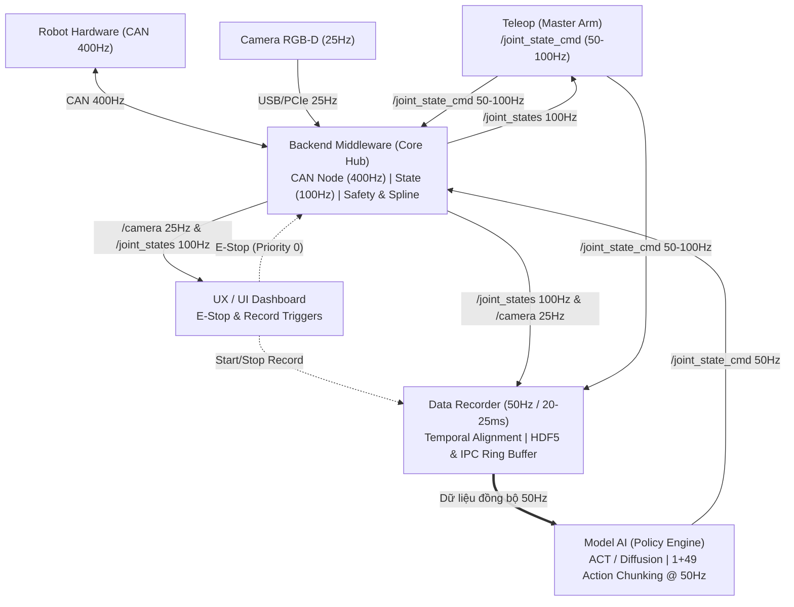

# OpenArm CAN

Nền tảng điều khiển cánh tay robot OpenArm thời gian thực qua CAN Bus, tích hợp thu thập dữ liệu Demonstration Teleoperation và suy luận mô hình AI tự hành (ACT / Diffusion Policy).

## Tài liệu Kỹ thuật và Quy tắc Bắt buộc
- **Kiến trúc Hệ thống Toàn diện:** Xem tại [ARCHITECTURE.md](file:///home/quan/openarm_can/ARCHITECTURE.md).
- **Quy tắc Phát triển Bắt buộc cho Agent & Dev:** Xem tại [GEMINI.md](file:///home/quan/openarm_can/GEMINI.md) và [AGENTS.md](file:///home/quan/openarm_can/AGENTS.md).
- **Quy tắc Workspace (.agents/rules):** Xem tại [.agents/rules/openarm_architecture_rules.md](file:///home/quan/openarm_can/.agents/rules/openarm_architecture_rules.md).

## Sơ đồ Tổng quan Hệ thống

## Khế ước Tần số Chuẩn
- **Robot CAN Bus:** 400 Hz (2.5 ms)
- **Camera RGB-D:** 25 Hz (40 ms)
- **`/joint_states`:** 100 Hz (10 ms)
- **Teleop `/joint_state_cmd`:** 50–100 Hz (10–20 ms)
- **Data Recorder Chu kỳ đồng bộ:** 50 Hz (20–25 ms/record)
- **Model AI Policy Suy luận:** 50 Hz (20 ms, xuất 1+49 action chunking)
