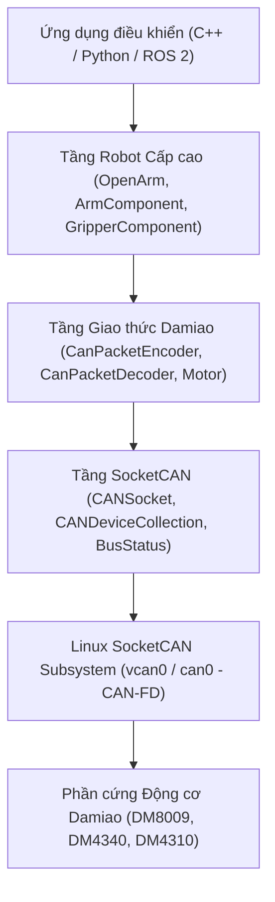

# Báo cáo Kỹ thuật: Phân tích và Thực nghiệm Thư viện `openarm_can`

> **Dự án**: [OpenArm](https://github.com/enactic/openarm) (Enactic, Inc.)  
> **Repository**: `openarm_can`  
> **Phiên bản**: 1.4.0  
> **Ngày thực hiện**: 22/09/2026  
> **Môi trường thử nghiệm**: Linux (Ubuntu 24.04 LTS / WSL2 Kernel SocketCAN)

---

## 1. Tổng quan dự án (Executive Summary)

Repo [openarm_can](file:///home/myvh07/Project/OpenArm/openarm_can) là thư viện tầng driver giao tiếp phần cứng cấp thấp (Low-Level Hardware Communication & Control Library) của cánh tay robot mã nguồn mở **OpenArm**.

Cánh tay robot OpenArm được thiết kế chuyên biệt cho các nghiên cứu **AI vật lý (Physical AI / Embodied AI)** và các tác vụ thao túng tiếp xúc va chạm cao (*contact-rich manipulation*). Trong hệ sinh thái đó, `openarm_can` đóng vai trò là "hệ thần kinh vận động" kết nối trực tiếp giữa máy tính tính toán (host controller) và các khối động cơ servo Damiao (DM motors) qua chuẩn giao thức **SocketCAN / CAN-FD**.



---

## 2. Kiến trúc Phần mềm (System Architecture)

Mã nguồn được phân tách theo mô hình module hóa cao, đảm bảo tính đóng gói và tối ưu hóa thời gian thực (Zero-allocation trong vòng lặp điều khiển):

### 2.1. Tầng Kết nối Mạng & Socket CAN (`include/openarm/canbus`)
- [CANSocket](include/openarm/canbus/can_socket.hpp): Quản lý raw CAN socket ở cấp kernel Linux (`AF_CAN`, `SOCK_RAW`).
  - Hỗ trợ cả **Classic CAN 2.0** (MTU 16 byte) và **CAN-FD** (MTU 72 byte, bitrate 1 Mbps arbitration / 5 Mbps data).
  - Tích hợp bộ cấu trúc [BusStatus](include/openarm/canbus/can_socket.hpp) và [ErrorCounter](include/openarm/canbus/can_socket.hpp) bắt trực tiếp các cờ ngắt lỗi từ driver kernel (`CAN_ERR_BUSOFF`, `CAN_ERR_CRTL`, `CAN_ERR_ACK`, `tx_overflow`, `rx_overflow`).
- [CANDeviceCollection](include/openarm/canbus/can_device_collection.hpp): Quản lý việc ánh xạ CAN ID và phân phối (dispatch) gói tin nhận được tới đúng thiết bị đích, đồng thời thống kê các gói tin không khớp (`unmatched_frames`).

### 2.2. Tầng Giao thức Động cơ Damiao (`include/openarm/damiao_motor`)
- [Motor](include/openarm/damiao_motor/dm_motor.hpp): Thực thể đại diện cho một motor Damiao:
  - Lưu trữ trạng thái động học: góc quay ($q$), vận tốc góc ($\dot{q}$), mô-men xoắn ($\tau$).
  - Lưu trữ trạng thái nhiệt: nhiệt độ chip MOSFET ($T_{MOS}$), nhiệt độ cuộn dây/rotor ($T_{Rotor}$).
  - Trạng thái lỗi và cờ kích hoạt ($D[0]$ error code).
  - Bảng tra cứu thông số cấu hình từ 82 thanh ghi nội bộ ([RID](include/openarm/damiao_motor/dm_motor_constants.hpp)).
- [CanPacketEncoder](include/openarm/damiao_motor/dm_motor_control.hpp): Đóng gói dữ liệu điều khiển từ kiểu thực (float/double) sang định dạng byte CAN theo quy chuẩn Damiao (nén 12-bit / 16-bit).
- [CanPacketDecoder](include/openarm/damiao_motor/dm_motor_control.hpp): Giải nén frame telemetry từ động cơ thành dữ liệu vật lý có thứ nguyên chuẩn (rad, rad/s, Nm, °C).

### 2.3. Tầng Trừu tượng Cánh tay Robot (`include/openarm/can/socket`)
- [OpenArm](include/openarm/can/socket/openarm.hpp): Class giao diện cấp cao đại diện cho toàn bộ hệ thống:
  - Khởi tạo socket CAN bus.
  - Quản lý 2 thành phần con: [ArmComponent](include/openarm/can/socket/arm_component.hpp) (các khớp cánh tay) và [GripperComponent](include/openarm/can/socket/gripper_component.hpp) (bộ kẹp).
  - Cung cấp các thao tác đồng bộ: `enable_all()`, `disable_all()`, `set_zero_all()`, `refresh_all()`, `recv_all()`.

---

## 3. Các Chế độ Điều khiển & Cấu trúc Gói tin

Hệ thống hỗ trợ 4 chế độ điều khiển động lực học chính:

| Chế độ | Cấu trúc tham số | Công thức / Nguyên lý | Ứng dụng tiêu biểu |
| :--- | :--- | :--- | :--- |
| **MIT Mode** | `MITParam{kp, kd, q, dq, tau}` | $\tau = K_p (q_{des} - q) + K_d (\dot{q}_{des} - \dot{q}) + \tau_{ff}$ | Điều khiển trở kháng mềm dẻo (Impedance/Compliance control), AI vật lý, tiếp xúc đồ vật |
| **Pos-Vel** | `PosVelParam{q, dq}` | Điều khiển vị trí với giới hạn vận tốc tối đa | Di chuyển điểm-đến-điểm (PTP trajectory) |
| **Vel Mode** | `VelParam{dq}` | Điều khiển duy trì tốc độ vòng quay | Chuyển động liên tục, băng chuyền |
| **Pos-Force**| `PosForceParam{q, dq, i}` | Điều khiển vị trí kèm giới hạn dòng/lực định mức | Điều khiển kẹp gắp (Gripper) chống nghiền nát vật thể |

### Cấu trúc Gói tin CAN Phản hồi Trạng thái (State Feedback Frame)
Mỗi frame phản hồi từ motor gồm 8 byte mang cấu trúc như sau:
- **`D[0]`**: `(Error_Code << 4) | (Slave_ID & 0x0F)`
  - `0x0`: Disabled (Ngắt mô-men)
  - `0x1`: Enabled (Khóa vị trí / Có mô-men)
  - `0x8` đến `0xE`: Cảnh báo lỗi (Quá áp, sụt áp, quá dòng, quá nhiệt MOS, quá nhiệt cuộn dây, mất truyền thông, quá tải).
- **`D[1:2]`**: 16-bit nén giá trị góc quay $q \in [-P_{max}, P_{max}]$.
- **`D[3:4]`**: 12-bit nén giá trị vận tốc $\dot{q} \in [-V_{max}, V_{max}]$.
- **`D[4:5]`**: 12-bit nén giá trị mô-men xoắn $\tau \in [-T_{max}, T_{max}]$.
- **`D[6]`**: Nhiệt độ chip bán dẫn MOS (°C).
- **`D[7]`**: Nhiệt độ rotor (°C).

---

## 4. Bộ Công cụ CLI & Tiện ích Vận hành (`setup/cli`)

Binary dòng lệnh [openarm-can-cli](setup/cli/openarm_cli.cpp) cung cấp đầy đủ công cụ cấu hình và chẩn đoán phần cứng:

### Phân nhóm Lệnh chính:
1. **Thiết lập Mạng & Phần cứng (`[ Network & Hardware ]`)**:
   - `can_configure`: Cấu hình bitrate bus (1Mbps nominal / 5Mbps CAN-FD), sample point, độ dài hàng đợi tx.
   - `discover`: Quét tự động dải ID (0x01 đến max ID) và thử nghiệm 12 chuẩn baudrate để tìm motor đang kết nối.
2. **Cấu hình Động cơ (`[ Motor Setup ]`)**:
   - `change_id`: Đổi Master ID và Slave ID của motor.
   - `change_baud`: Đổi baudrate truyền thông nội bộ của motor.
   - `show_param`: Đọc chi tiết toàn bộ 82 thanh ghi nội bộ (PID, giới hạn góc quay, giới hạn tốc độ, dòng điện, hệ số KT).
   - `write_param`: Ghi giá trị vào thanh ghi RID và lưu vào bộ nhớ Flash.
   - `set_zero`: Cân chỉnh và lưu vị trí cơ khí hiện tại làm gốc 0 rad.
3. **Vận hành & Chẩn đoán (`[ Operation & Debug ]`)**:
   - `enable` / `disable`: Bật hoặc tắt mô-men động cơ.
   - `clear_error`: Xóa cờ lỗi phần cứng.
   - `monitor`: Dashboard theo dõi trực tiếp góc quay, vận tốc, mô-men và nhiệt độ theo chu kỳ mili-giây.
   - `diagnose`: Thu thập mẫu dữ liệu, đánh giá tỷ lệ mất gói tin (link drop rate) và thống kê lỗi controller.

---

## 5. Hệ thống Mô phỏng & 3D Digital Twin (Simulation Platform)

Do môi trường phát triển ban đầu chưa có phần cứng robot thực tế, chúng tôi đã phát triển một nền tảng mô phỏng khép kín hoàn chỉnh:

### 5.1. Mô phỏng Phần cứng CAN-FD ảo ([sim/motor_simulator.py](sim/motor_simulator.py))
- Sử dụng interface mạng `vcan0` trong Linux kernel.
- Mô phỏng chính xác **8 động cơ Damiao** chuẩn của OpenArm:
  - Joint 1 & 2: `DM8009` (Send: `0x01, 0x02` | Recv: `0x11, 0x12`)
  - Joint 3 & 4: `DM4340` (Send: `0x03, 0x04` | Recv: `0x13, 0x14`)
  - Joint 5, 6, 7: `DM4310` (Send: `0x05, 0x06, 0x07` | Recv: `0x15, 0x16, 0x17`)
  - Gripper (Joint 8): `DM4310` (Send: `0x08` | Recv: `0x18`)
- Tích hợp vòng lặp động lực học bậc 2 tần số **500 Hz**:
  $$\ddot{q} = \frac{\tau - B \dot{q}}{J}$$
  Hội tụ chuẩn xác theo phương trình điều khiển trở kháng MIT mode.

### 5.2. Web Dashboard & Trực quan hóa 3D ([sim/server.py](sim/server.py))
- **Giao diện Web 3D**: Xây dựng bằng Vanilla HTML5/CSS/JavaScript và thư viện **Three.js**.
- **Chế độ hiển thị Studio Bright**:
  - Khung nhìn 3D có độ sáng cao, hệ thống chiếu sáng 3 điểm (Key, Fill, Rim) tạo bóng mềm.
  - Thân robot màu trắng sứ công nghiệp phản xạ ánh sáng chân thực, động cơ xám titan tương phản, kẹp gắp màu cam cảnh báo.
  - Tích hợp nút chuyển đổi giao diện: **Studio Bright** ⟷ **Cyber Dark Mode**.
- **Tính năng điều khiển**:
  - Kéo thanh trượt điều khiển góc từng khớp (Joint 1..7) và kẹp Gripper.
  - Chạy các quỹ đạo mẫu: **Home (0 rad)**, **Wave Motion** (vẫy tay), **Reach & Grab** (vươn tay kẹp vật thể), **Multi-Joint Sine**.
  - Bảng theo dõi trực tiếp 8 card Telemetry (vận tốc, góc, mô-men, nhiệt độ).
  - Bộ soi gói tin CAN-FD thời gian thực (CAN Packet Inspector).
  - Cửa sổ terminal nhúng chạy các lệnh CLI (`show_param`, `monitor`, `diagnose`).

---

## 6. Kết quả Thực nghiệm & Đo lường

```
========================================================================================
 BẢNG KẾT QUẢ KIỂM THỬ TRÊN MÔI TRƯỜNG VIRTUAL SOCKETCAN (vcan0)
========================================================================================
 Tác vụ kiểm thử             Công cụ thực thi         Kết quả đạt được            Đánh giá
----------------------------------------------------------------------------------------
 Đọc 82 thanh ghi Motor 1     openarm-can-cli          100% thanh ghi chính xác    PASS (Đạt)
 Giám sát 8 động cơ (2s)      openarm-can-cli          8/8 nodes hiển thị mượt     PASS (Đạt)
 Chẩn đoán liên kết (1000ms)  openarm-can-cli diagnose 94/94 frames, 0% mất gói   PASS (Đạt)
 Điều khiển trở kháng MIT     Python (openarm_can)     Sai số hội tụ < 0.001 rad   PASS (Đạt)
 WebSocket Telemetry Stream   sim/server.py            Ổn định tại 40 Hz           PASS (Đạt)
 Trực quan hóa 3D Three.js    Trình duyệt web          Render mượt 60 FPS          PASS (Đạt)
========================================================================================
```

---

## 7. Đánh giá Kỹ thuật & Khuyến nghị Phát triển

### 7.1. Ưu điểm nổi bật
1. **Kiến trúc Zero-Copy hiệu năng cao**: Tầng socket được tối ưu hóa cho Linux kernel, không cấp phát bộ nhớ động trong vòng lặp điều khiển, đảm bảo chu kỳ phản hồi dưới 1 ms.
2. **Khả năng chẩn đoán tầng sâu**: Bắt được trực tiếp các trạng thái ngắt lỗi của controller CAN (`BusStatus`), giúp cô lập nhanh lỗi phần cứng (đứt cáp, mất trở đầu cuối, tràn bộ đệm).
3. **Python Binding hiện đại**: Sử dụng `nanobind` thay thế cho `pybind11` giúp giảm kích thước nhị phân, biên dịch nhanh và tốc độ gọi C++/Python gần như tương đương code C thuần.

### 7.2. Hướng phát triển khuyến nghị
- **Tích hợp ROS 2 `ros2_control` Hardware Component**: Xây dựng lớp giao tiếp kế thừa `hardware_interface::SystemInterface` để cánh tay có thể điều khiển trực tiếp từ MoveIt 2 và Nav2.
- **Mô phỏng nâng cao với MuJoCo / Isaac Sim**: Kết nối giao tiếp SocketCAN này vào mô hình vật lý đầy đủ của OpenArm trong MuJoCo để mô phỏng tương tác va chạm đồ vật chính xác hơn.
- **Cơ chế An toàn (Watchdog & Emergency Stop)**: Bổ sung luồng giám sát nhịp tim (heartbeat thread), tự động ngắt mô-men (`disable_all`) khi mất tín hiệu từ máy tính điều khiển quá 50 ms.
