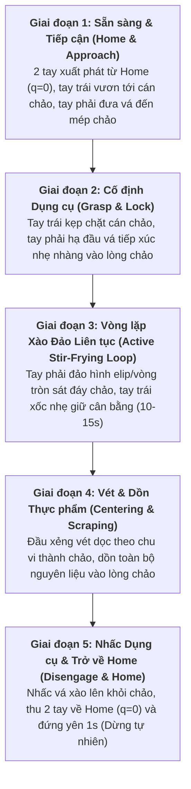

# Đặc Tả Use Case: Xào Nấu Tự Động Hai Tay (Autonomous Bimanual Cooking & Stir-Frying)
**Dự án**: VinRobotics - OpenArm Autonomous Manipulation  
**Hệ thống phần cứng**: Robot Bimanual OpenArm (16-DOF: 2 tay x [7 khớp xoay Damiao + 1 motor kẹp Gripper])  
**Cấu hình cảm biến**: **01 Camera RGB-D trước ngực (Chest RGB-D)**, kết nối CAN-FD qua SocketCAN `can0` và `can1`.

---

## 1. TỔNG QUAN USE CASE

* **Tên tác vụ**: Autonomous Bimanual Tabletop Cooking & Stir-Frying (Xào nấu / Đảo lật thực phẩm tự động 2 tay trên bếp).
* **Mục tiêu**: Huấn luyện mô hình AI **ACT (Action Chunking with Transformers)** điều khiển cánh tay robot hai tay OpenArm (16 khớp) phối hợp nhịp nhàng: một tay giữ/cố định hoặc xốc nhẹ cán chảo, tay còn lại cầm vá/xẻng xào thực hiện chu trình đảo, xới, vét lòng chảo và trộn đều nguyên liệu thực phẩm hoàn toàn tự động chỉ dựa vào **01 luồng camera RGB-D duy nhất gắn trước ngực**.
* **Đặc thù thách thức (Dynamic Cooking Manipulation & Contact-Rich Interaction)**:
  * **Tương tác tiếp xúc liên tục (Contact-Rich Interaction)**: Khác với tác vụ gắp đặt đơn thuần, xào nấu đòi hỏi đầu xẻng phải miết sát và trượt êm ái trên lòng chảo cong (Parabolic wok surface). Nếu điều khiển vị trí cứng nhắc, sai số vài milimét sẽ khiến xẻng đâm mạnh vào đáy chảo gây kẹt hoặc quá dòng motor; nếu nhấc quá cao sẽ không đảo được thức ăn. Chế độ **MIT Impedance Control** của OpenArm là yếu tố sống còn để duy trì lực tiếp xúc mềm dẻo.
  * **Phối hợp hai tay không đối xứng (Asymmetric Bimanual Coordination)**:
    * **Tay trái (Pan Hand)**: Nắm chắc chuôi/cán chảo, triệt tiêu phản lực rung lắc do tay phải xào tác động lên, đồng thời có thể thực hiện động tác xốc nghiêng chảo (Pan Tilting / Wok Tossing) đồng pha.
    * **Tay phải (Spatula Hand)**: Cầm vá xào, thực hiện quỹ đạo đảo vòng tròn/elip 3D liên tục, xới từ đáy đẩy lên và vét thành chảo dồn thức ăn về trung tâm.
  * **Đặc tính cơ học của thực phẩm**: Nguyên liệu thức ăn (rau củ, thịt xắt nhỏ) liên tục thay đổi hình thái, trơn trượt và phân bố ngẫu nhiên sau mỗi lần đảo. Mô hình phải thích ứng với sự biến thiên hình thái này thông qua thị giác chiều sâu thời gian thực.

---

## 2. THIẾT LẬP MÔI TRƯỜNG & KHÔNG GIAN BẾP (COOKING ENVIRONMENT SETUP)

| Thành phần | Đặc tả kỹ thuật | Ghi chú vận hành |
| :--- | :--- | :--- |
| **Vị trí Camera ngực** | Gắn cố định chính diện ngực robot, chúc góc xuống bếp $\approx 40^\circ - 45^\circ$ | Bao quát toàn cảnh mặt bếp, lòng chảo, vá xào và phạm vi vươn của cả 2 cánh tay |
| **Cảm biến thị giác** | Intel RealSense D435/D405 (RGB + Aligned Depth) $640 \times 480$ @ 50/60 FPS | Kênh Depth bắt buộc phải bật phần cứng `align_to_color` để khớp pixel 100% |
| **Khu vực nấu / Mặt bếp** | Bếp từ hoặc bàn thao tác kích thước $80 \times 80\text{ cm}$, bề mặt nhám/mờ (matte) | Chống trượt chân đế bếp, tránh bề mặt kính phản xạ gương làm chói cảm biến Depth |
| **Dụng cụ chảo nấu** | Chảo xào chống dính đường kính $26 - 30\text{ cm}$, thành chảo vát sâu $6 - 8\text{ cm}$ | Cán chảo bọc silicone/cao su ma sát cao để tay trái kẹp chắc chắn |
| **Dụng cụ vá/xẻng xào** | Vá xào chuyên dụng bằng gỗ hoặc silicone chịu nhiệt, dài $28 - 32\text{ cm}$ | Cán cầm hình trụ hoặc dẹt bọc lớp đệm tăng độ bám cho kẹp Gripper tay phải |
| **Nguyên liệu thao tác** | Thực phẩm mô phỏng (khối bọt xốp/hạt nhựa) hoặc rau củ/thịt xắt hạt lựu thực tế | Màu sắc tương phản với lòng chảo (ví dụ: nguyên liệu xanh/đỏ trên nền chảo đen) |

```text
               [ 📷 CAMERA TRƯỚC NGỰC RGB-D (40° - 45°) ]
                                │
                                │ (Quan sát toàn cảnh 2 tay, lòng chảo & thực phẩm)
                                ▼
       ┌────────────────────────────────────────────────────────┐
       │  [TAY TRÁI - CAN1]                [TAY PHẢI - CAN0]     │
       │       │                                   │            │
       │       ▼                                   ▼            │
       │  (Kẹp Cán Chảo)                  (Cầm Vá / Xẻng Xào)   │
       │       │                                   │            │
       │       ▼                                   ▼            │
       │  ┌─────────┐                     ┌─────────────────┐   │
       │  │ CÁN CHẢO│                     │ ĐẦU VÁ TRƯỢT SÁT│   │
       │  └────┬────┘                     │   LÒNG CHẢO     │   │
       │       │                          └────────┬────────┘   │
       │       ▼                                   ▼            │
       │   ╔═══════════════════════════════════════════════╗    │
       │   ║            CHẢO XÀO & NGUYÊN LIỆU             ║    │
       │   ║      (Quỹ đạo đảo vòng elip & xốc đáy chảo)   ║    │
       │   ╚═══════════════════════════════════════════════╝    │
       │               BẾP TỪ / MẶT BÀN THAO TÁC                │
       └────────────────────────────────────────────────────────┘
```

---

## 3. PHÂN CÔNG CHỨC NĂNG 16 KHỚP ROBOT (16-DOF ALLOCATION)

Mỗi chu kỳ 50Hz, mô hình ACT dự đoán một chunk 50 bước góc cho **16 động cơ Damiao**:

### 3.1. Tay Trái (Left Arm - CAN1: ID `0x01` .. `0x08`): Nhiệm vụ Giữ & Xốc Chảo
* **`Left_J1..J4` (Đế & Vai & Bắp tay)**: Định vị cánh tay đến vị trí cán chảo, duy trì độ cao ổn định và chống rung lắc.
* **`Left_J5..J7` (Cổ tay 3 trục)**: Thực hiện vi chỉnh góc nghiêng của chảo, hỗ trợ động tác xốc thức ăn (Wok Tossing) nhẹ khi cần.
* **`Left_J8_Gripper` (Kẹp nhíp trái)**: Khóa chặt cán chảo với lực kẹp ổn định ($q \approx 0.0 - 0.2\text{ rad}$ tùy kích thước cán).

### 3.2. Tay Phải (Right Arm - CAN0: ID `0x01` .. `0x08`): Nhiệm vụ Cầm Vá & Xào Đảo
* **`Right_J1..J4` (Đế & Vai & Khuỷu tay)**: Điều phối chuyển động tịnh tiến chính của xẻng trong không gian 3D (vươn vào lòng chảo, hạ xuống sát đáy, đẩy về phía trước và nâng lên).
* **`Right_J5..J7` (Cổ tay 3 trục)**: Điều khiển góc chúc của lưỡi xẻng áp sát mặt cong chảo, xoay lật cổ tay để hất ngược thực phẩm lên trên.
* **`Right_J8_Gripper` (Kẹp nhíp phải)**: Kẹp chặt cán vá xào, góc kẹp định hình cố định góc tiếp xúc.

---

## 4. QUY TRÌNH 5 GIAI ĐOẠN CỦA MỘT CHU KỲ XÀO NẤU (5-PHASE EXECUTION)



1. **Giai đoạn 1 (0.0s - 3.0s): Sẵn sàng & Tiếp cận (Home & Approach)**
   * Robot bắt đầu từ tư thế gốc Home ($q = \mathbf{0}$) giữ yên 1 giây.
   * Tay trái vươn đến vị trí cán chảo; tay phải nâng vá xào lên trên mép chảo $5\text{ cm}$.
2. **Giai đoạn 2 (3.0s - 5.0s): Cố định Dụng cụ (Grasp & Lock)**
   * Tay trái siết chặt kẹp giữ cán chảo.
   * Tay phải nhẹ nhàng đưa mặt xẻng tiếp xúc đáy chảo với độ mềm dẻo trở kháng MIT ($K_p = 25.0, K_d = 1.0$), kiểm soát mô-men không quá $2.0\text{ Nm}$.
3. **Giai đoạn 3 (5.0s - 18.0s): Vòng lặp Xào Đảo Liên tục (Active Stir-Frying Loop)**
   * Thực hiện chuỗi động tác đảo lật nhịp nhàng ở tần số $0.8 - 1.2\text{ Hz}$:
     * *Bước 3a (Xúc đáy)*: Đẩy xẻng từ mép ngoài trượt sâu xuống điểm thấp nhất của lòng chảo.
     * *Bước 3b (Nâng & Lật)*: Nâng nhẹ đầu xẻng lên $3 - 5\text{ cm}$ đồng thời xoay cổ tay lật nguyên liệu rơi ngược lại chảo.
     * *Bước 3c (Xốc phối hợp)*: Tay trái rung/nghiêng nhẹ cán chảo $5^\circ - 8^\circ$ để thực phẩm dồn lại tâm chảo.
4. **Giai đoạn 4 (18.0s - 21.0s): Vét & Dồn Thực phẩm (Centering & Scraping)**
   * Đầu xẻng miết một đường vòng tròn quanh chu vi thành chảo để vét hết các mảnh nguyên liệu dính ở thành dồn về trung tâm.
5. **Giai đoạn 5 (21.0s - 24.0s): Kết thúc & Trở về Home (Disengage & Home)**
   * Nhấc xẻng xào lên cách mặt chảo $10\text{ cm}$.
   * Thu đồng thời cả 2 cánh tay trở về vị trí Home ban đầu ($q_{\text{home}} = \mathbf{0}$) và giữ yên bất động trong $1.0\text{ giây}$.
   * Thuật toán nhận diện trạng thái dừng tự nhiên (*Implicit Termination*) ngắt vòng lặp điều khiển an toàn.

---

## 5. THÔNG SỐ ĐIỀU KHIỂN TRỞ KHÁNG MIT CHO TÁC VỤ XÀO NẤU

Để đảm bảo robot trượt xẻng mượt mà không làm trầy xước lòng chảo hay gãy dụng cụ:

| Nhóm Khớp | Độ cứng $K_p$ | Giảm chấn $K_d$ | Giới hạn Torque $\tau_{\text{max}}$ | Mục đích kỹ thuật |
| :--- | :---: | :---: | :---: | :--- |
| **Tay Trái J1..J7 (Giữ chảo)** | $35.0$ | $1.2$ | $15.0\text{ Nm}$ | Khóa cứng vị trí chảo, chống rung giật khi tay phải tác động lực |
| **Kẹp Trái J8 (Cán chảo)** | $30.0$ | $1.0$ | $8.0\text{ Nm}$ | Kẹp chặt không để tuột cán chảo |
| **Tay Phải J1..J4 (Cánh tay xào)** | $28.0$ | $1.0$ | $12.0\text{ Nm}$ | Dẫn hướng quỹ đạo chính xác nhưng có độ nhún đàn hồi |
| **Tay Phải J5..J7 (Cổ tay vá xào)** | $18.0$ | $0.8$ | $5.0\text{ Nm}$ | **Rất mềm dẻo**: Tự động lựa theo độ cong parabol của lòng chảo |
| **Kẹp Phải J8 (Cán vá)** | $25.0$ | $0.8$ | $6.0\text{ Nm}$ | Giữ chắc cán vá xào |

---

## 6. TIÊU CHÍ ĐÁNH GIÁ THÀNH CÔNG (SUCCESS METRICS)

1. **Độ đều của thực phẩm (Mixing Uniformity)**: $\ge 90\%$ lượng nguyên liệu được đảo lật ít nhất 3 lần trong chu kỳ 20 giây.
2. **Tỷ lệ văng bắn ra ngoài (Spill Rate)**: $< 3\%$ khối lượng thực phẩm bị văng ra ngoài lòng chảo.
3. **An toàn phần cứng (Hardware Safety)**:
   * $0$ sự cố va chạm quá lực ($|\tau| < 8\text{ Nm}$ trên cổ tay phải).
   * Nhiệt độ MOSFET và Rotor của cả 16 động cơ Damiao duy trì $< 55^\circ\text{C}$.
4. **Độ mượt quỹ đạo (Trajectory Smoothness)**: Sai số giật (Jerk) sau khi qua bộ lọc `TemporalEnsemblePolicy` giảm $> 70\%$ so với hành động thô rời rạc.
